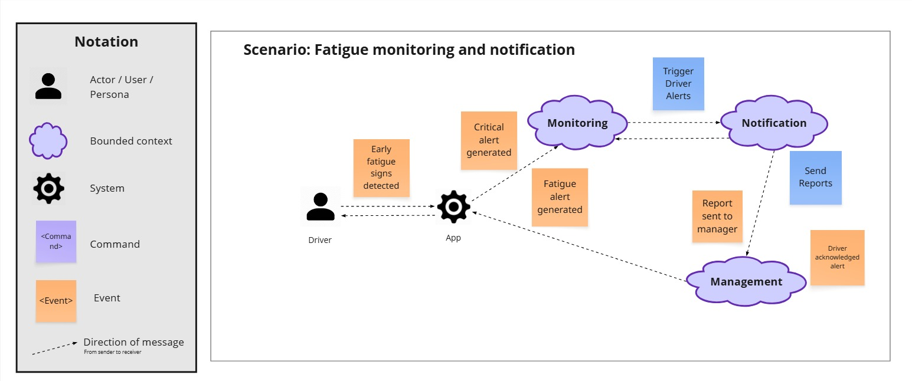
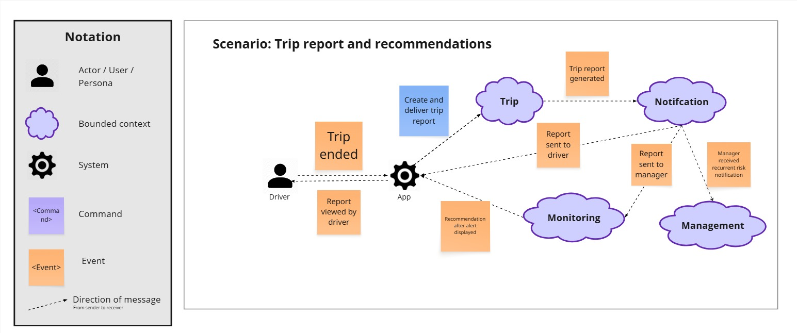
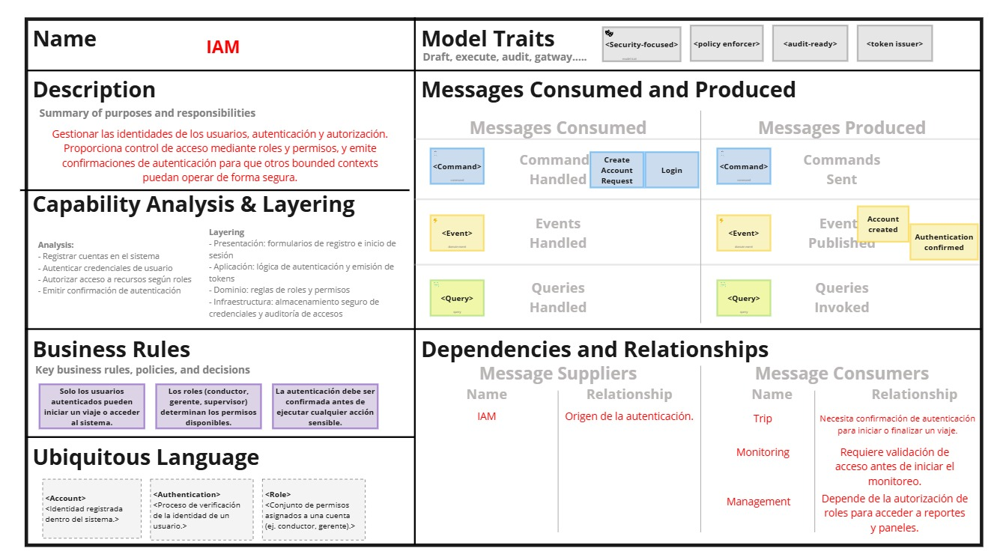

    <strong>Universidad Peruana de Ciencias Aplicadas</strong>     
    </img> 
    <strong>Ingeniería de Software</strong> 
     <strong>Arquitecturas de Software Emergentes - 7291</strong> 
     <strong>Docente: Rojas Malasquez, Royer Edelwer</strong>  
     <strong>Informe de Trabajo</strong> 

    <strong>Startup: PCC Team</strong> 
     <strong>Producto: Safe Vision</strong> 

    <h3 align="center">Team Members:</h3>

    <table align="center">
        <tr>
            <th style="text-align:center;">Nombre</th>
            <th style="text-align:center;">Código</th>
        </tr>
        <tr>
            <td style="text-align:center;">Herrera Aguirre, Fabia Alejandra</td>
            <td style="text-align:center;">U202219422</td>
        </tr>
        <tr>
            <td style="text-align:center;">Linares Tejada, Leonardo Felix Jesus</td>
            <td style="text-align:center;">U202211168</td>
        </tr>
        <tr>
            <td style="text-align:center;">Oneglio De Paz, Beth Shantal</td>
            <td style="text-align:center;">U202213423</td>
        </tr>
        <tr>
            <td style="text-align:center;">Salgado Luna, Fernando Brian</td>
            <td style="text-align:center;">U202212023</td>
        </tr>
        <tr>
            <td style="text-align:center;">Sosa Colca, Angelo Rodolfo</td>
            <td style="text-align:center;">U202212077</td>
        </tr>
    </table>
    

</body>

 <strong>2025-02</strong>

 

# Registro de Versiones del Informe

| **Versión** | **Fecha** | **Autor** | **Descripción de Modificación** |
|-------------|-----------|-----------|---------------------------------|
| 1.0         | 10/09/2025| Herrera, Linares, Oneglio, Salgada, Sosa | Creación del documento de trabajo en formato Markdown. |
| 2.0         | 10/09/2025| Herrera, Linares, Oneglio, Salgada, Sosa | Desarrollo del perfil de la startup y de la solución, identificación de segmentos objetivo y formulación de preguntas para el diseño de entrevistas. |
| 3.0         | 11/09/2025| Herrera, Linares, Oneglio, Salgada, Sosa | Redacción de las guías de estilo e infraestructura de la información. |
| 4.0         | 11/09/2025| Herrera, Linares, Oneglio, Salgada, Sosa | Realización y registro de entrevistas con los segmentos objetivo y análisis de los resultados. Creación del Impact Mapping. Redacción de las guías de estilo y la arquitectura de la información. |
| 5.0         | 13/09/2025| Herrera, Linares, Oneglio, Salgada, Sosa | Elaboración de historias de usuario y del backlog del producto. |
| 6.0         | 19/09/2025| Herrera, Linares, Oneglio, Salgada, Sosa | Creación del diagrama de base de datos, diagrama de clases, diccionario de clases, diagramas de contenedores, diagramas de contexto y diagramas de componentes. |

# Registro de Versiones del Informe

URL del repositorio para el Project Report en la organización de GitHub del equipo: https://github.com/Software-Emergentes

**TB1**

Para la elaboración del informe correspondiente a la entrega TB1, la implementación de las secciones se distribuyó entre los miembros del equipo de la siguiente manera:

| Integrante                          | Tareas asignadas |
|-------------------------------------|------------------|
| Fabia Alejandra Herrera Aguirre     | Needfinding, As Is, To Be, User Personas, Empathy Mapping, Product Backlog, User Task Matrix |
| Leonardo Felix Jesus Linares Tejada | Architectural Drivers Backlog, Architectural Design Decisions, Quality Attribute Scenario Refinements, Strategic-Level Domain-Driven Design, Event Storming, Candidate Context Discovery, Domain Message Flows Modeling, Bounded Context Canvases |
| Beth Shantal Oneglio De Paz         | Strategic-Level Attribute-Driven Design, Design Purpose, Attribute-Design Inputs, Primary Functionality (Primary User Stories), Quality attribute Scenarios, Constraints |
| Fernando Brian Salgada Luna         | Capítulo I: Introducción, Capítulo II: Requirements Elicitation & Analysis, Event Storming |
| Angelo Rodolfo Sosa Colca           | Context Mapping, Software Architecture, Software Architecture System Landscape Diagram, Software Architecture Context Level Diagrams, Container Level Diagrams, Deployment Diagrams, Event Storming |

La colaboración en el informe se llevó a cabo mediante commits frecuentes en el repositorio de la organización PCC Team.

GitHub Collaboration Insights

GitHub también muestra un historial de las ramas principales y los procesos de fusión realizados. Todas las ramas se crearon siguiendo el diseño de GitFlow para asegurar una adecuada organización al utilizar un sistema de control de versiones.

Los miembros del equipo son:

- Fabia Alejandra Herrera Aguirre

- Leonardo Felix Jesus Linares Tejada

- Beth Shantal Oneglio De Paz

- Fernando Brian Salgada Luna

- Angelo Rodolfo Sosa Colca

**TB1**

## Contenido

## Tabla de contenidos

## [Capítulo I: Introducción](#capítulo-i-introducción)
- [1.1. Startup Profile](#11-startup-profile)
  - [1.1.1. Descripción de la Startup](#111-descripción-de-la-startup)
  - [1.1.2. Perfiles de integrantes del equipo](#112-perfiles-de-integrantes-del-equipo)
- [1.2. Solution Profile](#12-solution-profile)
  - [1.2.1. Antecedentes y problemática](#121-antecedentes-y-problemática)
  - [1.2.2. Lean UX Process](#122-lean-ux-process)
    - [1.2.2.1. Lean UX Problem Statements](#1221-lean-ux-problem-statements)
    - [1.2.2.2. Lean UX Assumptions](#1222-lean-ux-assumptions)
    - [1.2.2.3. Lean UX Hypothesis Statements](#1223-lean-ux-hypothesis-statements)
    - [1.2.2.4. Lean UX Canvas](#1224-lean-ux-canvas)
- [1.3. Segmentos objetivo](#13-segmentos-objetivo)

## [Capítulo II: Requirements Elicitation & Analysis](#capítulo-ii-requirements-elicitation--analysis)
- [2.1. Competidores](#21-competidores)
  - [2.1.1. Análisis competitivo](#211-análisis-competitivo)
  - [2.1.2. Estrategias y tácticas frente a competidores](#212-estrategias-y-tácticas-frente-a-competidores)
- [2.2. Entrevistas](#22-entrevistas)
  - [2.2.1. Diseño de entrevistas](#221-diseño-de-entrevistas)
  - [2.2.2. Registro de entrevistas](#222-registro-de-entrevistas)
  - [2.2.3. Análisis de entrevistas](#223-análisis-de-entrevistas)
- [2.3. Needfinding](#23-needfinding)
  - [2.3.1. User Personas](#231-user-personas)
  - [2.3.2. User Task Matrix](#232-user-task-matrix)
  - [2.3.3. Empathy Mapping](#233-empathy-mapping)
  - [2.3.4. As-is Scenario Mapping](#234-as-is-scenario-mapping)
- [2.4. Ubiquitous Language](#24-ubiquitous-language)

## [Capítulo III: Requirements Specification](#capítulo-iii-requirements-specification)
- [3.1. To-Be Scenario Mapping](#31-to-be-scenario-mapping)
- [3.2. User Stories](#32-user-stories)
- [3.3. Impact Mapping](#33-impact-mapping)
- [3.4. Product Backlog](#34-product-backlog)

## [Capítulo IV: Strategic-Level Software Design](#capítulo-iv-strategic-level-software-design)
- [4.1. Strategic-Level Attribute-Driven Design](#41-strategic-level-attribute-driven-design)
  - [4.1.1. Design Purpose](#411-design-purpose)
  - [4.1.2. Attribute-Driven Design Inputs](#412-attribute-driven-design-inputs)
    - [4.1.2.1. Primary Functionality (Primary User Stories)](#4121-primary-functionality-primary-user-stories)
    - [4.1.2.2. Quality Attribute Scenarios](#4122-quality-attribute-scenarios)
    - [4.1.2.3. Constraints](#4123-constraints)
  - [4.1.3. Architectural Drivers Backlog](#413-architectural-drivers-backlog)
  - [4.1.4. Architectural Design Decisions](#414-architectural-design-decisions)
  - [4.1.5. Quality Attribute Scenario Refinements](#415-quality-attribute-scenario-refinements)
- [4.2. Strategic-Level Domain-Driven Design](#42-strategic-level-domain-driven-design)
  - [4.2.1. EventStorming](#421-eventstorming)
  - [4.2.2. Candidate Context Discovery](#422-candidate-context-discovery)
  - [4.2.3. Domain Message Flows Modeling](#423-domain-message-flows-modeling)
  - [4.2.4. Bounded Context Canvases](#424-bounded-context-canvases)
  - [4.2.5. Context Mapping](#425-context-mapping)
- [4.3. Software Architecture](#43-software-architecture)
  - [4.3.1. Software Architecture System Landscape Diagram](#431-software-architecture-system-landscape-diagram)
  - [4.3.2. Software Architecture Context Level Diagrams](#432-software-architecture-context-level-diagrams)
  - [4.3.3. Software Architecture Container Level Diagrams](#433-software-architecture-container-level-diagrams)
  - [4.3.4. Software Architecture Deployment Diagrams](#434-software-architecture-deployment-diagrams)

## [Conclusiones](#conclusiones)
- [Conclusiones](#conclusiones)
- [Conclusiones y recomendaciones](#conclusiones-y-recomendaciones)

## [Video About-the-Team](#video-about-the-team)

## [Bibliografía](#bibliografía)

## [Anexos](#anexos)

----

# Student Outcome

| Criterio específico | Acciones realizadas | Conclusiones |
|----------------------|---------------------|--------------|
| Comunica oralmente sus ideas y/o resultados con objetividad a público de diferentes especialidades y niveles jerárquicos, en el marco del desarrollo de un proyecto en ingeniería. | Fabia Alejandra Herrera Aguirre     **TB1**     Se expusieron los resultados del Needfinding, mostrando el As Is y el To Be, además de explicar los User Personas y el Empathy Mapping en presentaciones grupales.   Leonardo Felix Jesus Linares Tejada    **TB1**    Se presentaron los Architectural Drivers Backlog y las Architectural Design Decisions, explicando cómo se refinaron los Quality Attribute Scenarios y los resultados del Event Storming en sesiones grupales.  Beth Shantal Oneglio De Paz   **TB1**    Se expuso el Strategic-Level Attribute-Driven Design, destacando el Design Purpose y los Primary User Stories, junto con los Quality Attribute Scenarios más relevantes.    Fernando Brian Salgada Luna    **TB1**    Se presentó el Capítulo I: Introducción y el Capítulo II: Requirements Elicitation & Analysis, explicando los puntos clave y los resultados del Event Storming en exposición grupal.  Angelo Rodolfo Sosa Colca   **TB1**    Se explicó el Context Mapping y los diagramas de Software Architecture (System Landscape, Context Level, Container y Deployment), además de los hallazgos del Event Storming en presentaciones grupales. | El trabajo realizado ha sido sobresaliente, cumpliendo con todos los segmentos del proyecto. El documento redactado ofrece un detallado informe sobre los pasos seguidos en la planificación, desarrollo y envío del proyecto a producción, garantizando así un resultado digno y completo. |
| Comunica en forma escrita ideas y/o resultados con objetividad a público de diferentes especialidades y niveles jerárquicos, en el marco del desarrollo de un proyecto en ingeniería. | Fabia Alejandra Herrera Aguirre    **TB1**    Se documentaron los hallazgos en el Product Backlog y se elaboró la User Task Matrix, complementada con la descripción escrita de escenarios y perfiles de usuario.   Leonardo Felix Jesus Linares Tejada    **TB1**    Se documentaron los hallazgos del Candidate Context Discovery, los Domain Message Flows Modeling y los Bounded Context Canvases, integrándolos en el informe de Strategic-Level Domain-Driven Design.    Beth Shantal Oneglio De Paz    **TB1**    Se documentaron los Attribute-Design Inputs y las Constraints, integrándolos en el reporte de diseño estratégico para el proyecto.   Fernando Brian Salgada Luna    **TB1**    Se redactaron los apartados del informe correspondientes a la Introducción, el Requirements Elicitation & Analysis y la documentación del Event Storming.    Angelo Rodolfo Sosa Colca    **TB1**    Se documentaron los diagramas de Software Architecture y el Context Mapping, junto con la descripción escrita del Event Storming, integrados en el informe técnico.  | El trabajo realizado ha sido sobresaliente en términos de comunicación, cubriendo todos los aspectos necesarios para garantizar una coordinación efectiva. El documento final no solo detalla los pasos seguidos en la planificación y desarrollo del proyecto, sino que también refleja una comunicación clara y precisa durante todo el proceso, asegurando así una entrega bien fundamentada y comprensible. |

# Capítulo I: Introducción

## 1.1. Startup Profile

En esta sección se ofrece una descripción del startup y se detallan los perfiles de los integrantes del equipo.

### 1.1.1. Descripción de la Startup

SafeVision es una startup dedicada a mejorar la seguridad de los conductores en carretera mediante un sistema de inteligencia artificial que detecta en tiempo real signos de somnolencia. A través de una cámara en la cabina y una aplicación móvil, se emiten alertas inmediatas para prevenir accidentes. Además, los datos son procesados en la nube, lo que permite a las empresas de transporte acceder a reportes y monitorear el estado de sus conductores de forma continua.

###  Misión:

Contribuir a la reducción de accidentes de tránsito en carreteras mediante el desarrollo de soluciones tecnológicas basadas en inteligencia artificial que permitan monitorear el estado de los conductores en tiempo real, promoviendo la seguridad, el bienestar y la responsabilidad en la conducción.

### Visión:

Convertirnos en una startup líder en el Perú en soluciones inteligentes para la seguridad vial, reconocida por nuestra innovación tecnológica y por nuestro aporte en la creación de carreteras más seguras, donde la tecnología y la prevención trabajen juntas para salvar vidas.

### 1.1.2. Perfiles de integrantes del equipo

| Miembros del Equipo                  | Código Estudiante | Carrera                | Descripción | Imagen |
|-------------------------------------|------------------|-----------------------|---------------------------------------------------------------|------|
| Herrera Aguirre, Fabia Alejandra     | U202219422       | Ingeniería de Software | Soy Fabia Herrera, estudiante de 8vo ciclo, me considero una persona creativa y responsable, valores que considero serán útiles para garantizar entregas óptimas para este proyecto. Entre mis habilidades técnicas están los lenguajes de programación C#, Java, C++, Python y JavaScript principalmente, y el uso de los frameworks Angular y Vue. |  |
| Linares Tejada, Leonardo Félix Jesús | U202211168       | Ingeniería de Software | Mi nombre es Leonardo Linares, tengo 20 años y estoy en el 8vo ciclo de la UPC, estudiando para ser un Ingeniero de Software. Actualmente, tengo conocimientos sobre lenguajes y tecnologias como Python, C++, C#, HTML, JavaScript, MySQL, etc. |  |
| Oneglio De Paz, Beth Shantal         | U202213423       | Ingeniería de Software | Mi nombre es Beth Shantal Oneglio De Paz - u202213423, tengo 20 años y estudio Ingeniería de Software en la UPC. Disfruto trabajar en equipo y resolver problemas digitales. Estoy capacitada para enfrentar situaciones estresantes con responsabilidad y liderazgo. Poseo conocimientos avanzados en gestión y programación, adquiridos en ciclos anteriores. Manejo lenguajes y tecnologías como Python, C++, HTML5, CSS3, .NET, Vue.js, C#, JavaScript, PHP, MongoDB, MySQL, entre otras. |  |
| Salgado Luna, Fernando Brian        | U202212023        | Ingeniería de Software | Soy Fernando Salgado, tengo 20 años y me apasiona la tecnología. Tengo experiencia en desarrollo frontend y backend, trabajando con lenguajes y tecnologías como Python, C++, C#, Java, HTML, CSS, JavaScript, MySQL, así como frameworks de frontend como Vue.js y Angular. Disfruto resolviendo problemas y buscando soluciones prácticas que contribuyan a los proyectos en los que participo. |  |
| Sosa Colca Angello Rodolfo          | U202212077       | Ingeniería de Software | Tengo 19 años y curso el 7mo ciclo de la carrera de Ingeniería de Software en la Universidad Peruana de Ciencias Aplicadas. Soy una persona enfocada, perseverante y colaborativo. Estas cualidades me permiten ser una persona que ayudará de manera óptima el requisito que se me imponga. Además, soy una persona que apoya cuando los demás se encuentran en problemas. |  |

## 1.2. Solution Profile

Está compuesta por dos secciones:

### Antecedentes y Problemática:

Esta sección describe el problema que el proyecto busca resolver. Incluye el enunciado del problema, una descripción de los aspectos clave que la solución debe abordar, así como los objetivos y las restricciones del proyecto.

### Lean UX Process:

Esta sección aplica el proceso de Lean UX y detalla cómo se abordará la resolución del problema mediante el modelo de negocio.

### 1.2.1. Antecedentes y problemática

#### Uso de la técnica The 5'W's w Y 2'H's

| LAS 5W y 2H | Pregunta                                                | Descripción                                                                                                                                                                                                                                                                                                                                                                                                                                                                                                          |
| ----------- | ------------------------------------------------------- | -------------------------------------------------------------------------------------------------------------------------------------------------------------------------------------------------------------------------------------------------------------------------------------------------------------------------------------------------------------------------------------------------------------------------------------------------------------------------------------------------------------------- |
| What?       | ¿Cuál es el problema?                                   | El problema se centra en la somnolencia al volante, que es una de las principales causas de accidentes de tránsito en el Perú, especialmente en viajes de larga distancia e interprovinciales. Los conductores presentan parpadeos frecuentes, bostezos o cabeceos debido al cansancio, lo que disminuye su capacidad de reacción. La falta de herramientas tecnológicas que detecten estos signos en tiempo real incrementa el riesgo de siniestros, con consecuencias humanas, económicas y legales. |
| When?       | ¿Cuándo ocurre el problema?                              | Se presenta principalmente durante trayectos prolongados, en horarios nocturnos o de madrugada, y en turnos extendidos de conducción donde la fatiga se acumula. También puede darse en cualquier momento en que el conductor haya tenido pocas horas de descanso previo. |
| Where?      | ¿Dónde ocurre el problema?                               | El problema se observa en carreteras nacionales e interprovinciales del Perú, donde se realizan viajes largos y de varias horas. Ocurre en la etapa de conducción, cuando el conductor debe mantener concentración constante para evitar accidentes. |
| Who?        | ¿A quién afecta el problema?                             | Afecta a conductores de transporte interprovincial, conductores particulares que viajan por carretera y a las empresas de transporte responsables de la seguridad de sus trabajadores y pasajeros. No necesariamente está relacionado con las habilidades, sino con la fatiga física y mental, incluso en conductores experimentados. |
| Why?        | ¿Por qué sucede el problema?                              | Ocurre porque los viajes prolongados y la falta de descanso adecuado generan cansancio extremo, disminuyendo reflejos, concentración y capacidad de reacción. La ausencia de sistemas de monitoreo en tiempo real impide alertar al conductor o a las empresas para tomar medidas preventivas. |
| How?        | ¿Cómo se diferencia el problema del estado normal?       | En un estado óptimo, el conductor se encuentra alerta y con plena capacidad de reacción. El problema aparece cuando, por cansancio, se reduce la atención, aumentando la probabilidad de accidentes. La situación se agrava por la falta de mecanismos automáticos que detecten señales de somnolencia y emitan alertas. |
| How Much?   | ¿Con qué frecuencia o en qué cantidad se utilizará nuestro producto? | SafeVision se usará constantemente en viajes interprovinciales y de larga distancia, donde la somnolencia es una de las principales causas de accidentes. Los incidentes por fatiga generan pérdidas económicas, legales y humanas. La inversión en cámaras, sensores y software se recupera mediante un modelo de suscripción mensual por flota o conductor, ofreciendo alertas y reportes en tiempo real para prevenir accidentes. |

                               
#### Objetivos:

- Identificar de manera oportuna señales de somnolencia en los conductores.  
- Emitir alertas inmediatas al conductor para prevenir accidentes.  
- Brindar a las empresas de transporte reportes detallados y métricas de seguridad sobre sus conductores.  

#### Restricciones:

- Se requiere conexión a internet para la transmisión y procesamiento de datos en la nube.  
- La efectividad del reconocimiento facial puede variar según la iluminación o la posición de la cámara.  
- El alcance inicial se limita a viajes interprovinciales y de larga distancia, sin considerar aún transporte urbano.  

### 1.2.2. Lean UX Process

El proceso Lean UX nos permite diseñar y validar soluciones centradas en el usuario, enfocándonos en crear valor de manera ágil y eficiente. En esta sección se describen los problemas principales que enfrentan los usuarios, las suposiciones de negocio y de usuario, así como las hipótesis que guiarán el desarrollo del sistema SafeVision. Este enfoque asegura que cada decisión de diseño esté basada en evidencia y en la validación temprana con los usuarios finales.

#### 1.2.2.1. Lean UX Problem Statements

En nuestro contexto, una gran parte de los accidentes en carretera está relacionada con la fatiga y la somnolencia de los conductores, especialmente en viajes nocturnos o de larga distancia. Estos accidentes generan pérdidas humanas y económicas significativas, además de afectar la seguridad vial en general.
En los últimos años, se ha identificado que los accidentes por somnolencia continúan siendo frecuentes en rutas interprovinciales, a pesar de campañas de concientización y regulaciones de descanso obligatorio, lo que evidencia la necesidad de herramientas tecnológicas que monitoreen el estado del conductor en tiempo real. La pregunta que nos planteamos es:

¿Cómo puede SafeVision, siendo utilizado por los conductores profesionales y supervisores de flotas, detectar señales de fatiga y somnolencia para prevenir accidentes y mejorar la seguridad vial de manera efectiva?

#### Problema:

Los conductores presentan signos de cansancio como parpadeos frecuentes, cabeceos o bostezos, que muchas veces pasan desapercibidos hasta que ocurre un siniestro. Actualmente no existen soluciones accesibles y tecnológicas que puedan alertarlos a tiempo ni herramientas para que las empresas de transporte puedan supervisar de forma efectiva el estado de sus choferes.

#### Impacto:

Nuestra propuesta busca reducir los accidentes relacionados con la fatiga al detectar en tiempo real señales de somnolencia mediante visión artificial y alertar al conductor de manera inmediata. Además, proporcionará a las empresas reportes sobre la condición de sus choferes, lo que permitirá tomar medidas preventivas y fortalecer la seguridad en carretera.

#### 1.2.2.2. Lean UX Assumptions

#### Business Outcomes:

- **Reducción de accidentes por fatiga:** 20% menos accidentes en empresas de transporte tras 6 meses de uso.  
- **Adopción de la solución:** Al menos el 60% de las flotas participantes en el piloto adoptarán la plataforma.  
- **Mejora en la percepción de seguridad:** Incremento del 40% en la sensación de seguridad por parte de los conductores.  
- **Fortalecimiento de la reputación empresarial:** Mejora en la confianza y reputación de las empresas de transporte que implementen el sistema.  

----

#### User Assumptions:

**¿Quién es el usuario?**  
- Conductores profesionales de buses interprovinciales y camiones de carga.  
- Gerentes o supervisores de flotas responsables de la seguridad de los conductores.  

**¿Dónde entra nuestro producto en su trabajo o su vida?**  
- **Para los conductores:** como un asistente digital dentro de la cabina que monitorea su estado de alerta durante la conducción.  
- **Para los gerentes/supervisores:** como una herramienta de monitoreo y reporte en la nube que permite tomar decisiones preventivas y gestionar riesgos en tiempo real.  

**¿Cuál es el problema que nuestro producto soluciona?**  
- Detecta signos de fatiga y somnolencia que pueden pasar desapercibidos hasta que ocurren accidentes.  
- Previene accidentes, disminuye riesgos y ayuda a cumplir normas de seguridad vial.  

**¿Cómo y cuándo nuestro producto es usado?**  
- Durante la conducción, especialmente en viajes largos, nocturnos o interprovinciales.  
- El conductor recibe alertas inmediatas en la cabina; el supervisor revisa reportes periódicos o en tiempo real según sea necesario.  

**¿Qué características son importantes?**  
- Precisión en la detección de fatiga (parpadeos, bostezos, cabeceos).  
- Alertas claras y no invasivas para el conductor.  
- Reportes confiables y accesibles para los supervisores.  
- Interfaz sencilla, intuitiva y segura para todos los usuarios.  

---

#### User Outcomes & Benefits:

**Para los conductores:**  
- Alertas oportunas que previenen accidentes y aumentan la confianza durante viajes largos.  
- Se espera que al menos el 70% de los conductores perciba mayor seguridad y mantenga el uso activo de la aplicación.  

**Para los gerentes o supervisores:**  
- Reportes confiables que facilitan la toma de decisiones y permiten reducir costos por accidentes.  
- Se proyecta que al menos el 60% de los supervisores use regularmente los reportes para gestionar riesgos.  

**Para la sociedad:**  
- Disminución de accidentes en carreteras y mayor seguridad vial.  
- Reducción estimada del 20% de los incidentes relacionados con fatiga en rutas monitoreadas tras los primeros 6 meses de implementación.  

---

#### Business Assumptions:

- Las empresas de transporte buscan soluciones tecnológicas que reduzcan accidentes e indemnizaciones.  
- Los conductores aceptarán el uso de cámaras si se garantiza la privacidad de los datos.  
- El modelo de negocio basado en suscripción por flota es más atractivo que un pago único elevado.  

#### 1.2.2.3. Lean UX Hypothesis Statements

Para la elaboración de los Hypothesis Statements se utilizó el formato Lean UX: [We believe that], [This will achieve], [We will have demonstrated this when]. Este enfoque permite conectar directamente las funcionalidades del producto con los resultados esperados y definir cómo se validará cada hipótesis con evidencia concreta.

- **Hypothesis Statement 01:**

Creemos que si el sistema detecta signos de somnolencia y distracción con al menos un 85 % de precisión, incluyendo parpadeos frecuentes, bostezos y cabeceos, esto logrará mejorar significativamente la seguridad de los conductores durante viajes largos y nocturnos, y lo sabremos cuando el número de incidentes por fatiga en rutas monitoreadas se reduzca en un 20 % y se registre una disminución de comportamientos de riesgo detectados por el sistema.

- **Hypothesis Statement 02:**

Creemos que si los reportes en la nube ofrecen datos claros, gráficos de fácil interpretación y alertas organizadas por nivel de riesgo, esto logrará que los gerentes y supervisores confíen en la solución para tomar decisiones preventivas, y lo sabremos cuando al menos el 60 % de los gerentes de transporte revise semanalmente los reportes y actúe en base a ellos para reducir riesgos de fatiga.

- **Hypothesis Statement 03:**

Creemos que si la aplicación móvil alerta al conductor con mensajes claros, auditivos y visuales, no invasivos pero efectivos, esto logrará que los conductores reaccionen oportunamente ante señales de somnolencia y mantengan niveles óptimos de atención, y lo sabremos cuando al menos el 70 % de los conductores mantenga el uso activo de la aplicación durante sus viajes nocturnos o de larga distancia.

- **Hypothesis Statement 04:**

Creemos que si se implementan alertas personalizables según el nivel de fatiga y el comportamiento individual de cada conductor, esto logrará aumentar la efectividad de las notificaciones y la adherencia al sistema, y lo sabremos cuando los conductores respondan correctamente al 90 % de las alertas emitidas y se observe una disminución de episodios críticos de somnolencia.

- **Hypothesis Statement 05:**

Creemos que si se generan patrones de riesgo agregados y se presentan visualmente en un panel centralizado para supervisores, esto logrará que los gerentes identifiquen proactivamente a los conductores en riesgo y puedan planificar medidas preventivas, y lo sabremos cuando se reduzcan los incidentes recurrentes por fatiga en rutas monitoreadas en al menos un 15 % adicionales y se mejore la eficiencia de las decisiones de supervisión.

#### 1.2.2.4. Lean UX Canvas

El Lean UX Canvas es una herramienta empleada en el ámbito del diseño centrado en el usuario (UX) y la metodología Lean, con el propósito de desarrollar productos de manera más eficiente y eficaz. Su finalidad es ofrecer un marco estructurado que facilita la colaboración entre equipos multidisciplinarios. A continuación, se presenta el Lean UX Canvas que el equipo ha trabajado utilizando Canva.

  

## 1.3. Segmentos objetivo

El sistema está enfocado en los principales actores que enfrentan directamente la problemática de la somnolencia y la fatiga en carretera:  

- **Conductores profesionales (buses interprovinciales y camiones de carga)**  

Este segmento está compuesto por personas de entre 25 y 55 años que realizan jornadas prolongadas, a menudo en horarios nocturnos o de madrugada, incrementando la probabilidad de somnolencia y distracción al volante. Su labor requiere mantener un nivel constante de concentración durante viajes largos e interprovinciales, y son directamente afectados por la fatiga, lo que hace necesario un sistema que les emita alertas oportunas para prevenir accidentes y mejorar su seguridad durante la conducción.  

- **Gerentes o supervisores de flotas de transporte**

Este grupo incluye personas de entre 30 y 55 años responsables de la seguridad y operación de los conductores en viajes interprovinciales o de larga distancia. Su rol implica monitorear el estado de alerta de los conductores mediante reportes en tiempo real, tomar decisiones preventivas para reducir riesgos y garantizar el cumplimiento de normas de seguridad, con el objetivo de disminuir accidentes, mejorar la gestión de riesgos y optimizar la operación diaria de la flota.

# Capítulo II: Requirements Elicitation & Analysis

El análisis competitivo es fundamental para la toma de decisiones estratégicas, ya que permite identificar oportunidades y amenazas, además de contribuir a la creación de ventajas competitivas sostenibles en el mercado. Esta herramienta es crucial para que las empresas se mantengan ágiles y tomen decisiones informadas en un entorno empresarial en constante evolución. A continuación, se muestra cómo se ha integrado esta herramienta en el desarrollo del proyecto y el análisis de los competidores.

## 2.1. Competidores

### 2.1.1. Análisis competitivo

<table>
    <thead>
    <tr>
    <th colspan=6>Competitive Analysis Landscape</th>
    </tr>
        <tr>
    <th colspan=6>¿Por qué llevar a cabo este análisis?</th>
    </tr>
        <tr>
    <th colspan=6>Para dar a conocer a los competidores que se presentan en nuestra Startup.</th>
    </tr>
        <tr>
            <th colspan=2></th>
            <th>SafeVision </th>
            <th>Anka Perú </th>
            <th>Bonitel </th>
            <th>Risk Control </th>
        </tr>
    </thead>
    <tbody>
        <tr>
            <td rowspan=2 align="center">Perfil</td>
            <td align="center">Overview</td>
            <td align="center">Plataforma basada en IA que usa cámara en cabina para analizar en tiempo real signos de fatiga. Envía alertas inmediatas al conductor y genera reportes en la nube para las empresas.</td>
            <td  align="center">Solución que combina cámara en cabina con sensores de vibración en el asiento, GPS y monitoreo en la nube para detectar fatiga y distracción.</td>
            <td  align="center">Ofrece sensores DMS (Driver Monitoring System) y ADAS que identifican parpadeos, bostezos y distracciones. Se integra con sistemas GPS para control de flotas.</td>
            <td align="center">Sistema integral con cámaras 360° que detectan múltiples riesgos: fatiga, uso de celular, humo, distracciones. Envía alertas al conductor y a un centro de control.</td>
        </tr>
        <tr>
            <td align="center">Ventaja competitiva ¿Qué valor ofrece a los clientes?</td>
            <td align="center">Solución accesible y adaptada al contexto peruano, bajo costo de implementación, integración con app móvil y reportes en la nube.</td>
            <td align="center">Alta precisión con hardware adicional (cámara + vibración + GPS), ideal para transporte formal.</td>
            <td align="center">Alta precisión en la detección gracias a sensores DMS (Driver Monitoring System) y la integración con GPS para rastreo en tiempo real. Es una solución tecnológica avanzada ya validada en el mercado.</td>
            <td align="center">Cobertura amplia que no solo mide fatiga, sino también otros riesgos dentro del vehículo, convirtiéndose en una solución integral de seguridad vehicular.</td>
        </tr>
        <tr>
            <td rowspan= 5 align="center">Perfil de Marketing</td>
            <td align="center">Mercado Objetivo</td>
            <td align="center">Empresas de transporte interprovincial y de carga en Perú, conductores de larga distancia.</td>
            <td align="center">Empresas de transporte formal con flotas medianas y grandes.</td>
            <td align="center">Empresas con flotas que ya cuentan con infraestructura GPS y buscan complementarla.</td>
            <td align="center">Empresas corporativas de transporte interprovincial, de carga y minería.</td>
        </tr>
        <tr>
            <td align="center">Estrategias de Marketing</td>
            <td align="center">Alianzas con transportistas locales, campañas de concientización sobre seguridad vial, pruebas piloto con empresas medianas.</td>
            <td align="center">Paquetes corporativos y convenios con empresas establecidas.</td>
            <td align="center">Venta directa de hardware a empresas formales y distribución a través de partners tecnológicos.</td>
            <td align="center">Ofertas premium dirigidas a contratos corporativos.</td>
        </tr>
        <tr>
            <td align="center">Productos & servicios</td>
            <td align="center">Cámara en cabina + aplicación móvil + plataforma en la nube.</td>
            <td align="center">Cámara + vibración en asiento + GPS + nube.</td>
            <td align="center">Sensor DMS + ADAS + integración GPS.</td>
            <td align="center">Cámaras 360° + alertas múltiples + monitoreo en la nube.</td>
        </tr>
        <tr>
            <td align="center">Precios & Costos</td>
            <td align="center">Modelo de suscripción accesible con baja inversión inicial.</td>
            <td align="center">Inversión inicial media-alta, dirigido a empresas con presupuesto.</td>
            <td align="center">Alto costo, ya que requiere hardware especializado y mantenimiento.</td>
            <td align="center">Costo elevado, con instalación especializada y planes corporativos.</td>
        </tr>
        <tr>
            <td align="center">Canales de distribución (Web y/o móvil)</td>
            <td align="center">Web y app móvil.</td>
            <td align="center">Plataforma web y equipos instalados en cabina.</td>
            <td align="center">Web, distribuidores especializados en transporte.</td>
            <td align="center">Web y ventas directas a empresas.</td>
        </tr>
        <tr>
            <td rowspan= 4 align="center">Análisis SWOT</td>
            <td align="center">Fortalezas</td>
            <td align="center">Accesible, adaptado al mercado local, integración móvil en tiempo real, reportes en la nube.</td>
            <td align="center">Solución robusta con integración de múltiples tecnologías.</td>
            <td align="center">Alta precisión, integración con sistemas existentes.</td>
            <td align="center">Amplio rango de detección de riesgos, alta confiabilidad.</td>
        </tr>
        <tr>
            <td align="center">Debilidades</td>
            <td align="center">Startup emergente con poco reconocimiento de marca.</td>
            <td align="center">Costoso para empresas pequeñas o informales.</td>
            <td align="center">Elevado costo y dependencia de infraestructura previa.</td>
            <td align="center">Alto costo y complejidad de implementación.</td>
        </tr>
        <tr>
            <td align="center">Oportunidades</td>
            <td align="center">Mayor necesidad de seguridad vial en Perú; formalización del transporte.</td>
            <td align="center">Expansión a transporte de carga pesada.</td>
            <td align="center">Mayor adopción en empresas que buscan profesionalizar sus flotas.</td>
            <td align="center">Creciente interés en sistemas integrales para seguridad vial.</td>
        </tr>
        <tr>
            <td align="center">Amenazas</td>
            <td align="center">Competidores con más capital; resistencia al cambio en transporte informal.</td>
            <td align="center">Nuevas startups con soluciones más accesibles y fáciles de implementar.</td>
            <td align="center">Soluciones más simples, móviles y baratas.</td>
            <td align="center">Startups con soluciones más específicas, rápidas y accesibles.</td>
        </tr>
    </tbody>
</table>

### 2.1.2. Estrategias y tácticas frente a competidores

Basado en el análisis competitivo previo, se identificaron claramente las fortalezas, oportunidades, debilidades y amenazas de los competidores. Esta información es fundamental para diseñar estrategias y tácticas que permitan superar a la competencia cuando el servicio se lance al mercado de manera rentable. A continuación, se presentan una serie de estrategias y tácticas planificadas para lograr este objetivo.

#### Estrategias Competitivas de SafeVision

**Diferenciación de Servicios**

- Para posicionarse como la solución más accesible y adaptada al contexto peruano, SafeVision utilizará cámaras convencionales y smartphones sin necesidad de hardware adicional costoso, lo que facilita su adopción. Además, se promocionará la facilidad de uso y la rápida implementación como principales ventajas competitivas frente a sistemas más complejos o importados.

**Calidad Constante**

- La fiabilidad del sistema será el factor clave para generar confianza en transportistas y conductores. Para lograrlo, se realizarán pilotos con flotas interprovinciales recopilando métricas sobre la reducción de incidentes, y se implementarán actualizaciones periódicas basadas en el feedback real de los usuarios, asegurando un servicio confiable y en constante mejora.

**Precios Competitivos**

- Safe Vision se ofrecerá como una alternativa más económica frente a sistemas importados de alto costo. Se implementará un modelo de suscripción flexible orientado a empresas pequeñas y medianas, y se desarrollarán campañas de marketing que comparen precios mostrando los ahorros que las flotas pueden obtener al elegir SafeVision frente a la competencia.

**Servicio al Cliente de Calidad**

- El soporte cercano marcará la diferencia frente a soluciones extranjeras. Para ello, SafeVision ofrecerá atención en español 24/7 y capacitación rápida tanto para choferes como para gerentes de transporte, asegurando que todos los usuarios puedan aprovechar al máximo el sistema desde el primer día.

**Alianzas Estratégicas**

- Las colaboraciones serán clave para aumentar la credibilidad y la adopción del sistema. SafeVision firmará convenios con empresas de transporte interprovincial para pruebas piloto, y establecerá acuerdos con aseguradoras para que las flotas que implementen la solución obtengan beneficios o descuentos, incentivando su uso y generando confianza en el mercado.

## 2.2. Entrevistas

La sección detalla cómo investigamos nuestros segmentos objetivo mediante la recopilación de datos a través de entrevistas.

### 2.2.1. Diseño de entrevistas

- Preguntas generales:

1. ¿Cuál es tu nombre?
2. ¿Qué edad tienes?
3. ¿Dónde vives actualmente?
4. ¿A qué te dedicas?

Preguntas dirigidas a Conductores interprovinciales y de larga distancia.

----

1. ¿Ha experimentado situaciones de somnolencia al volante? ¿Cómo las maneja?
2. ¿Qué señales o síntomas nota primero cuando empieza a sentirse somnoliento mientras conduce?
3.  ¿Cuánto cree que influye el cansancio acumulado de días anteriores en su nivel de alerta al conducir?
4. ¿En qué momento del viaje considera más difícil mantenerse atento (madrugada, después de comer, largas rectas)?
5. ¿Qué situaciones cree que generan mayor riesgo de somnolencia en la carretera?
6. ¿Cómo percibe que la fatiga afecta su tiempo de reacción frente a situaciones de riesgo en la carretera?
7. ¿Qué tipo de alertas le resultan más efectivas (sonoras, visuales, vibración en el móvil)?
8. ¿Qué preocupaciones tendría sobre la privacidad al usar un sistema que monitorea su rostro y gestos?
9. ¿Le parecería útil usar un sistema que lo alerte en tiempo real sobre su fatiga?
10. ¿Qué tan dispuesto estaría a usar un sistema que registre datos sobre su conducción para reportarlos a la empresa?
11. ¿Qué mejoras cree que un sistema de monitoreo podría aportar a su seguridad y desempeño al conducir?

Preguntas dirigidas Gerentes.

----

1. ¿Cuántos conductores o vehículos administra en promedio su flota?
2. ¿Cuáles son los principales riesgos que enfrentan en los viajes interprovinciales?
3. ¿Cómo controlan actualmente la fatiga o estado de sus choferes?
4. ¿Qué métricas utilizan para evaluar el desempeño y seguridad de sus conductores?
5. ¿Qué indicadores priorizan al evaluar a sus conductores (accidentes, multas, horas de descanso)?
6. ¿Qué valor tendría para su empresa contar con reportes en la nube sobre el estado de los conductores?
7. ¿Qué factores considerarían más importantes para decidir adquirir un sistema como SafeVision (precio, efectividad, facilidad de uso)?
8. ¿Qué tan confiables consideran los sistemas actuales para detectar fatiga y prevenir accidentes?
9. ¿Estarían dispuestos a implementar un sistema que genere alertas automáticas a los conductores y reportes en tiempo real para supervisores?
10. ¿Qué beneficios creen que obtendrían al usar un sistema que permita anticipar riesgos de somnolencia y distracción en sus conductores?

---

### 2.2.2. Registro de entrevistas

Entrevista a Conductores interprovinciales y de larga distancia.

| **Entrevista 1** | Omar Morales Montalvo Andrew             |
|--------------|--------------|
| Edad         |      25        |
| Distrito     |       San Juan de Lurigancho       |
|      |   Omar es un conductor de una famosa empresa de transportes, el nos habla de su experiencia conduciendo. Además de ello, habla de como se gestiona cuando tiene fatiga, tambien menciona que una combinacion de ciertos patrones puede oncasionarle fatiga, el apreciaria la implementacion de una aplicacion que permita alertarle constantemente en caso empiece a tener signos de somnolencia.   |
| Timing:      |    3:51 - 7:13 |
| **Entrevista 2** | Maria del Carmen Tejada Miranda          |
| Edad         |     60         |
| Distrito     |     Bellavista        |
|    |   Maricarmen Tejada es una conductora de transporte interprovincial que vive en Bellavista, Callao. Ella comparte su experiencia al enfrentar la somnolencia en viajes largos, especialmente en la madrugada o después de comer. Reconoce síntomas como párpados pesados, bostezos y pérdida de concentración, además de que el cansancio acumulado empeora su estado de alerta. Señala que la fatiga retrasa sus tiempos de reacción y que los tramos largos y rectos generan mayor riesgo. Considera que las alertas sonoras combinadas con mensajes visuales serían las más efectivas, aunque expresa preocupación por la privacidad de un sistema que monitoree su rostro. Aun así, ve útil una herramienta que la alerte en tiempo real y que registre datos de conducción siempre que haya transparencia en su uso. Concluye que un sistema de monitoreo podría ayudarla a tomar descansos a tiempo y dar mayor seguridad a pasajeros y empresa.        |
| Timing:      |   00:04 - 3:51 |
| **Entrevista 3** |              |
| Edad         |              |
| Distrito     |              |
| **Imagen**   |              |
| Timing:      |  7:13 - 12:11 |

 

Entrevista a Gerentes de empresas de transporte.

| **Entrevista 1** | **Juan Jesús Calisaya Sánchez** |
|--------------|--------------|
| Edad         | 21           |
| Distrito     | Lima         |
|   | Juan, gerente de transporte, comentó que administra unos 50 buses y que la fatiga de los conductores es el principal riesgo. Actualmente usan protocolos de descanso, pero no siempre resultan efectivos. Valora contar con reportes en la nube y prioriza efectividad y facilidad de uso por encima del precio. Estaría dispuesto a implementar SafeVision si es confiable, ya que le permitiría reducir accidentes, mejorar la seguridad y optimizar la gestión de su flota. |
| Timing:     | 12:14 - 16:15 |
| **Entrevista 2** | 
**Ernesto Miguel Vilca López**
             |
| Edad         |  29            |
| Distrito     |  Lince            |
|    |  Miguel es un jefe de flota en la empresa MORCOR, una empresa de transporte de herramientas interprovincial. Nos comenta que tiene bajo supervición a 70 empleados y 30 camiones, a quienes monitorea por medios de comunicación tradicionales (véase, llamadas periódicas, mensajes de texto, entre otros). Por ello, le interesó la propuesta que ofrece el equipo con SafeVision, pues supone una gran mejora en la gestión del personal. Asimismo, mencionó que es muy importante para él que la herramienta tenga un precio módico dada la gran cantidad de buses con los que cuenta la empresa. |
| Timing:      |  16:15 - 25:19 |
| Entrevista 3 |              |
| Edad         |              |
| Distrito     |              |
| **Imagen**   |              |
| Timing:      | 25:19 - 29:59 |

**Vídeo de Entrevistas:** <a href="https://upcedupe-my.sharepoint.com/:v:/g/personal/u202219422_upc_edu_pe/EYdM5BSerG9LmmI8HzXfedIBCf1U1gUS7K7ZgdUX-EXHYg?nav=eyJyZWZlcnJhbEluZm8iOnsicmVmZXJyYWxBcHAiOiJPbmVEcml2ZUZvckJ1c2luZXNzIiwicmVmZXJyYWxBcHBQbGF0Zm9ybSI6IldlYiIsInJlZmVycmFsTW9kZSI6InZpZXciLCJyZWZlcnJhbFZpZXciOiJNeUZpbGVzTGlua0NvcHkifX0&e=Wgod4y">https://upcedupe-my.sharepoint.com/:v:/g/personal/u202219422_upc_edu_pe/EYdM5BSerG9LmmI8HzXfedIBCf1U1gUS7K7ZgdUX-EXHYg?nav=eyJyZWZlcnJhbEluZm8iOnsicmVmZXJyYWxBcHAiOiJPbmVEcml2ZUZvckJ1c2luZXNzIiwicmVmZXJyYWxBcHBQbGF0Zm9ybSI6IldlYiIsInJlZmVycmFsTW9kZSI6InZpZXciLCJyZWZlcnJhbFZpZXciOiJNeUZpbGVzTGlua0NvcHkifX0&e=Wgod4y </a>

### 2.2.3. Análisis de entrevistas

Según las entrevistas realizadas y los resúmenes, hemos llevado a cabo un análisis de las entrevistas en el que destacamos las similitudes y hallazgos:

**Análisis de Conductores interprovinciales y de larga distancia**

Durante las entrevistas con los conductores se identificó que la fatiga y la somnolencia son problemas frecuentes debido a las largas jornadas y a la presión por cumplir horarios. Ellos mencionaron que, aunque existen descansos programados, no siempre son respetados por la dinámica del trabajo. Coincidieron en que contar con alertas en tiempo real sería de gran ayuda para prevenir accidentes y mejorar su seguridad personal. Asimismo, valoran que la herramienta sea sencilla de usar y no interfiera en la conducción.

**Análisis de Gerentes de empresas de transporte**

Las entrevistas con los gerentes revelaron que la principal preocupación está en la seguridad de los pasajeros y la reducción de accidentes. Señalaron que actualmente aplican protocolos de descanso y métricas de desempeño como accidentes y multas, aunque reconocen limitaciones en su efectividad. Consideran que un sistema como SafeVision tendría un alto valor si ofrece reportes en la nube y monitoreo en tiempo real, ya que permitiría tomar decisiones rápidas y optimizar la gestión de la flota. Además, priorizan la efectividad y la facilidad de uso por encima del precio, y estarían dispuestos a implementar la solución siempre que garantice confiabilidad y buena integración.

## 2.3. Needfinding

### 2.3.1. User Personas

- Segmento Conductores interprovinciales y de larga distancia:

El segmento de conductores profesionales de buses interprovinciales y camiones de carga está compuesto por personas de entre 25 y 55 años que realizan jornadas prolongadas, a menudo en horarios nocturnos o de madrugada, incrementando la probabilidad de somnolencia y distracción al volante. Su labor requiere mantener un nivel constante de concentración durante viajes largos e interprovinciales, y son directamente afectados por la fatiga, lo que hace necesario un sistema que les emita alertas oportunas para prevenir accidentes y mejorar su seguridad durante la conducción.

  

 

- Segmento de Gerentes de empresas de transporte:

El segmento de gerentes o supervisores de flotas de transporte incluye personas de entre 30 y 55 años responsables de la seguridad y operación de los conductores en viajes interprovinciales o de larga distancia. Su rol implica monitorear el estado de alerta de los conductores mediante reportes en tiempo real, tomar decisiones preventivas para reducir riesgos y garantizar el cumplimiento de normas de seguridad, con el objetivo de disminuir accidentes, mejorar la gestión de riesgos y optimizar la operación diaria de la flota.

  

### 2.3.2. User Task Matrix

En esta parte se expone la User Task Matrix, la cual detalla las tareas que los usuarios deben realizar para alcanzar sus objetivos al interactuar con el sistema SafeVision. La matriz está organizada por segmentos de usuarios, objetivos y tareas específicas, proporcionando una visión clara de las funcionalidades necesarias para satisfacer las necesidades de los conductores profesionales y los gerentes de flotas.

| Task                                                   | Conductor Profesional (Frecuencia / Importancia) | Gerente de Flota (Frecuencia / Importancia) |
| ------------------------------------------------------ | ------------------------------------------------ | ---------------------- |
| Mantenerse alerta durante el viaje                     | Alta / Alta                                      | Baja / Alta            |
| Recibir alertas de somnolencia en tiempo real          | Alta / Alta                                      | Baja / Alta            |
| Revisar su propio historial de alertas                 | Media / Alta                                     | Baja / Media           |
| Tomar descansos cuando el sistema lo recomienda        | Media / Alta                                     | Baja / Media           |
| Monitorear en tiempo real el estado de los conductores | –                                                | Alta / Alta            |
| Recibir reportes automáticos de desempeño y fatiga     | Baja / Media                                     | Alta / Alta            |
| Analizar tendencias de fatiga para planificar turnos   | –                                                | Media / Alta           |
| Justificar decisiones de cambio de turnos o descansos  | –                                                | Media / Alta           |
| Garantizar la seguridad de los pasajeros               | Alta / Alta                                      | Alta / Alta            |
| Reducir accidentes por somnolencia                     | Alta / Alta                                      | Alta / Alta            |

### 2.3.3. Empathy Mapping

A continuación se presenta el Empathy Map que detalla las percepciones, pensamientos, sentimientos y comportamientos de los dos segmentos de usuarios principales: conductores profesionales y gerentes de flotas. Este mapa ayuda a comprender mejor sus necesidades y motivaciones al interactuar con el sistema SafeVision.

- Segmento Conductores interprovinciales y de larga distancia:

  

 

- Segmento de Gerentes de empresas de transporte:

  

### 2.3.4. As-is Scenario Mapping

- Segmento Conductores interprovinciales y de larga distancia:

  

  
 

- Segmento de Gerentes de empresas de transporte:

  

  
 

Enlace del Miro: <a href="https://miro.com/app/board/uXjVJI4Pgq0=/?share_link_id=121411571054">https://miro.com/app/board/uXjVJI4Pgq0=/?share_link_id=121411571054</a>
 

## 2.4. Ubiquitous Language

En esta sección se presenta el Ubiquitous Language, que define los términos clave utilizados en el contexto del sistema SafeVision. Este lenguaje común facilita la comunicación entre los diferentes actores involucrados, asegurando que todos comprendan claramente los conceptos y funcionalidades del producto.

| **Término (Inglés)**  | **Término (Español)**                  | **Definición**                                                                                                                        |
| ------------------- | -------------------------------------- | ----------------------------------------------------------------------------------------------------------------------------------------------- |
| Professional Driver | Conductor profesional                  | Persona que opera vehículos de transporte interprovincial de pasajeros, cumpliendo con normas de seguridad y tiempos de ruta establecidos.      |
| Fleet Manager       | Jefe de operaciones / Gerente de flota | Responsable de coordinar, supervisar y evaluar el rendimiento de los conductores y vehículos dentro de una empresa de transporte.               |
| Passenger Safety    | Seguridad del pasajero                 | Condición de protección y cuidado de los pasajeros durante el viaje, evitando riesgos de accidentes por fatiga o negligencia.                   |
| Fatigue Detection   | Detección de fatiga                    | Proceso de identificar señales físicas o comportamentales que indican cansancio del conductor, como parpadeo excesivo o bostezos.               |
| Alert System        | Sistema de alertas                     | Mecanismo que notifica al conductor y/o al gerente de flota sobre riesgos inmediatos de fatiga o somnolencia para tomar acción preventiva.      |
| Driving Shift       | Turno de conducción                    | Período de tiempo en el que un conductor se encuentra asignado a manejar un vehículo dentro de una ruta o itinerario programado.                |
| Rest Stop           | Parada de descanso                     | Intervalo planificado o no planificado durante un viaje en el que el conductor puede recuperarse de la fatiga antes de continuar.               |
| Route Monitoring    | Monitoreo de ruta                      | Seguimiento en tiempo real del estado del viaje, incluyendo ubicación del vehículo, condiciones del conductor y cumplimiento de tiempos.        |
| Incident Prevention | Prevención de incidentes               | Acciones y medidas adoptadas para evitar accidentes en carretera, especialmente aquellos relacionados con somnolencia.                          |
| Compliance          | Cumplimiento normativo                 | Adherencia a las regulaciones legales y protocolos internos que garantizan la seguridad de los pasajeros y la salud del conductor.              |
| Performance Report  | Informe de desempeño                   | Documento generado que contiene métricas sobre la conducción, incidentes de fatiga y cumplimiento de rutas, utilizado para evaluación y mejora. |
| Safety Culture      | Cultura de seguridad                   | Conjunto de valores y prácticas dentro de la empresa de transporte que priorizan la seguridad del conductor y del pasajero en la operación.     |

# Capítulo III: Requirements Specification

## 3.1. To-Be Scenario Mapping

Para elaborar el To-be Scenario Mapping, el equipo definió cómo sería el flujo de trabajo después de la implementación de nuestra solución, para ambos segmentos objetivos. El propósito de este artefacto es comparar y abordar los aspectos negativos identificados en el As-is Scenario.

- Segmento Conductores interprovinciales y de larga distancia:

  

  

 

- Segmento de Gerentes de empresas de transporte:

  

  

 

Enlace del To-Be Scenario Mapping: <a href="https://miro.com/app/board/uXjVJI4Pgq0=/?share_link_id=121411571054">https://miro.com/app/board/uXjVJI4Pgq0=/?share_link_id=121411571054</a>

## 3.2. User Stories

Las user stories son una manera de transformar el lenguaje informal de los clientes en requisitos de software que deben ser considerados durante el desarrollo del sistema. Una user story bien elaborada proporciona al desarrollador una explicación clara de la funcionalidad que se está construyendo, su propósito y el valor que ofrece al usuario. 

| Epic/Story ID | Título                                   | Descripción                                                                                                                   | Criterios de Aceptación                                                                                                                                       | Relacionado con (Epic ID) |
|---------------|-------------------------------------------|-------------------------------------------------------------------------------------------------------------------------------|---------------------------------------------------------------------------------------------------------------------------------------------------------------|----------------------------|
| **Epic 1**    | Detección y Alertas al Conductor          | Como conductor quiero que el sistema detecte signos de somnolencia y me alerte en tiempo real para evitar accidentes.          | –                                                                                                                                                             | –                          |
| US01          | Detección de somnolencia en tiempo real   | Como conductor, quiero que el sistema identifique signos de fatiga para recibir alertas inmediatas y evitar accidentes.        | Dado que el conductor muestra parpadeos o cabeceos, cuando la cámara lo detecte, entonces se generará una alerta sonora y visual en cabina.                  | Epic 1                     |
| US02          | Notificación inmediata al conductor       | Como conductor, quiero recibir alertas preventivas en el momento adecuado para reaccionar y mantenerme seguro.                 | Dado que el sistema detecta señales de somnolencia, cuando supere el umbral definido, entonces me notificará con vibración o sonido.                         | Epic 1                     |
| US03          | Alerta por micro-sueños                   | Como conductor, quiero que el sistema detecte cierres prolongados de ojos para evitar quedarme dormido al volante.             | Dado que los ojos permanecen cerrados, cuando supere 2 segundos, entonces se generará una alerta crítica.                                                     | Epic 1                     |
| US04          | Alerta sonora y visual configurable       | Como conductor, quiero que las alertas tengan volumen y modo visual configurables para asegurar efectividad sin distracción.   | Dado que se detecta fatiga, cuando se active la alerta, entonces sonará con la intensidad configurada y se mostrará en pantalla.                             | Epic 1                     |
| US05          | Guía post-alerta                          | Como conductor, quiero que la app me dé instrucciones simples tras una alerta (ej. hidratarme, detenerme) para reaccionar mejor.| Dado que se genera una alerta crítica, cuando la reciba, entonces se mostrará una recomendación inmediata.                                                    | Epic 1                     |
| US06          | Recordatorio de descanso obligatorio      | Como conductor, quiero recibir notificaciones cuando supere cierto tiempo de conducción continua para poder tomar pausas.      | Dado que el tiempo de conducción supera las 4 horas, cuando no haya descanso registrado, entonces el sistema enviará una alerta de pausa obligatoria.         | Epic 1                     |
| US07          | Historial personal de alertas y viajes    | Como conductor, quiero consultar mi historial de alertas y viajes para conocer mis patrones de fatiga y mejorar mis hábitos.   | Dado que el conductor inicia sesión en la app, cuando seleccione "Historial", entonces verá la lista de viajes previos y alertas registradas.                 | Epic 1                     |
| US08          | Reporte resumido por viaje                | Como conductor, quiero recibir un resumen al finalizar mi recorrido para entender cómo fue mi desempeño en cuanto a somnolencia.| Dado que el viaje finaliza, cuando cierre sesión, entonces recibirá un reporte con cantidad de alertas y nivel de riesgo.                                    | Epic 1                     |
| US09          | Reporte de viaje saludable                | Como conductor, quiero visualizar recomendaciones personalizadas después de mi viaje para mejorar mi rendimiento futuro.       | Dado que termina un viaje, cuando se genere el reporte, entonces incluirá sugerencias como horarios de descanso y hábitos recomendados.                      | Epic 1                     |
| US10          | Feedback del sistema                      | Como conductor, quiero poder enviar comentarios o marcar falsas alarmas para mejorar la precisión del sistema.                 | Dado que el conductor recibe una alerta, cuando considere que fue incorrecta, entonces podrá marcarla como "falsa alarma" y enviar feedback.                 | Epic 1                     |
| US11          | Integración cámara–app automática         | Como conductor, quiero que la cámara se conecte automáticamente con la aplicación al iniciar el viaje sin configuración manual.| Dado que la cámara está encendida, cuando se abra la app, entonces se sincronizará automáticamente.                                                           | Epic 1                     |
| US12          | Modo de prueba de alertas                 | Como conductor, quiero probar el sistema de alertas antes de iniciar el viaje para asegurarme de que funciona correctamente.   | Dado que el conductor activa el "modo prueba", cuando ejecute la simulación, entonces el sistema generará una alerta sonora y visual de verificación.         | Epic 1                     |
| **Epic 2**    | Gestión y Monitoreo de Conductores        | Como gerente quiero monitorear a los conductores en tiempo real y acceder a reportes para garantizar seguridad en la flota.    | –                                                                                                                                                             | –                          |
| US13          | Acceso a reportes de seguridad            | Como gerente, quiero visualizar reportes sobre el estado de los conductores para tomar decisiones preventivas.                 | Dado que los datos se guardan en la nube, cuando el gerente acceda a la plataforma, entonces podrá consultar reportes históricos.                             | Epic 2                     |
| US14          | Notificación crítica al gerente           | Como gerente, quiero recibir alertas en tiempo real de conductores en riesgo para intervenir rápidamente.                      | Dado que un conductor está en nivel crítico de fatiga, cuando el sistema lo detecte, entonces enviará un aviso inmediato al gerente.                          | Epic 2                     |
| US15          | Dashboard general de flota                | Como gerente, quiero un panel centralizado para ver el estado actual de todos los conductores y priorizar acciones.            | Dado que hay varios conductores conectados, cuando el gerente ingrese al dashboard, entonces visualizará su estado en tiempo real.                           | Epic 2                     |
| US16          | Detección de patrones de riesgo           | Como gerente, quiero que el sistema identifique patrones recurrentes de somnolencia para tomar medidas preventivas.            | Dado que el sistema analiza datos históricos, cuando un conductor acumule alertas en franjas repetidas, entonces notificará al gerente.                       | Epic 2                     |
| US17          | Alertas agregadas por horas de viaje      | Como gerente, quiero ver en qué franjas horarias se presentan más alertas para mejorar la planificación de turnos.             | Dado que existen datos de viajes, cuando seleccione la opción, entonces se mostrarán las franjas horarias con mayor riesgo.                                   | Epic 2                     |
| US18          | Notificación de viaje seguro completado   | Como gerente, quiero recibir un aviso cuando un conductor finaliza un recorrido sin alertas críticas.                          | Dado que el viaje termina, cuando no existan alertas críticas, entonces se enviará notificación de éxito.                                                     | Epic 2                     |
| US19          | Exportación de métricas                   | Como gerente, quiero exportar reportes en distintos formatos (PDF, Excel) para auditorías internas.                            | Dado que existen datos de seguridad, cuando solicite exportar, entonces el sistema generará el archivo.                                                       | Epic 2                     |
| US20          | Geolocalización en tiempo real            | Como gerente, quiero ver en un mapa la ubicación de cada conductor en tiempo real.                                             | Dado que el vehículo está en ruta, cuando el gerente acceda al dashboard, entonces visualizará la posición actual en el mapa.                                 | Epic 2                     |
| US21          | Comparación entre conductores             | Como gerente, quiero comparar métricas de somnolencia entre conductores para identificar a los que requieren apoyo.            | Dado que existen datos históricos, cuando seleccione "comparar", entonces se mostrarán gráficas comparativas.                                                 | Epic 2                     |
| US22          | Panel de estadísticas generales de flota  | Como gerente, quiero ver estadísticas globales de la flota (alertas totales, viajes seguros, descansos cumplidos).             | Dado que accede el gerente al dashboard, cuando seleccione "estadísticas de flota", entonces se mostrarán métricas globales.                                  | Epic 2                     |
| US23          | Notificación de pérdida de conexión       | Como gerente, quiero recibir notificación si el sistema pierde conexión con un conductor.                                      | Dado que la cámara o app pierde señal, cuando ocurra la desconexión, entonces notificará automáticamente al gerente.                                           | Epic 2                     |
| US24          | Registro de mantenimiento del sistema     | Como empresa, quiero registrar las fechas de mantenimiento de cámaras y dispositivos para asegurar su funcionamiento.          | Dado que se realiza un mantenimiento, cuando se registre en la plataforma, entonces quedará almacenado con fecha y observaciones.                             | Epic 2                     |
| US25          | Privacidad de datos personales            | Como empresa, quiero que los datos de los conductores estén encriptados para proteger su información.                          | Dado que se almacenan datos, cuando se guarden en la nube, entonces estarán encriptados.                                                                      | Epic 2                     |
| **Epic 3**    | Administración y Seguridad del Sistema    | Como empresa quiero gestionar usuarios, roles y configuraciones para mantener un sistema seguro y adaptable.                   | –                                                                                                                                                             | –                          |
| US26          | Registro de conductores                   | Como gerente, quiero registrar a los conductores en la plataforma para tener un control organizado de la flota.                | Dado que el gerente ingresa a administración, cuando complete los datos, entonces el sistema guardará la información.                                         | Epic 3                     |
| US27          | Registro de usuario                       | Como nuevo usuario, quiero registrarme en la plataforma para acceder al sistema SafeVision según mi rol.                       | Dado que soy un nuevo usuario, cuando complete el registro, entonces el sistema creará mi cuenta.                                                              | Epic 3                     |
| US28          | Login de usuario                          | Como usuario registrado, quiero iniciar sesión para acceder a las funcionalidades de mi rol.                                   | Dado que tengo cuenta activa, cuando ingrese email y contraseña correctos, entonces accederé al dashboard de mi rol.                                          | Epic 3                     |
| US29          | Validación de rol de usuario              | Como sistema, quiero validar el rol del usuario para mostrar funcionalidades apropiadas.                                       | Dado que un usuario inicia sesión, cuando se valide su rol, entonces será redirigido al dashboard correspondiente.                                             | Epic 3                     |
| US30          | Configuración de parámetros de seguridad  | Como gerente, quiero ajustar umbrales de detección de fatiga según políticas internas.                                         | Dado que accede a configuración, cuando modifique valores de umbral, entonces el sistema actualizará la detección.                                            | Epic 3                     |
| US31          | Gestión de roles de usuario               | Como empresa, quiero asignar diferentes roles (gerente, supervisor, conductor) para controlar accesos.                         | Dado que se crea un nuevo usuario, cuando se asigne un rol, entonces se mostrarán permisos adecuados.                                                          | Epic 3                     |
| **Epic 4**    | Landing Page de SafeVision                | Como visitante quiero una página clara y atractiva que comunique los beneficios y facilite el registro.                        | –                                                                                                                                                             | –                          |
| US32          | Sección Hero con CTA                      | Como visitante, quiero ver un mensaje claro con un botón de acción principal para entender el valor de SafeVision y registrarme fácilmente.| Dado que accedo a la landing, cuando se cargue la página, entonces visualizaré un titular, descripción breve y un botón “Empieza ahora”. | Epic 4                     |
| US33          | Sección About Us                          | Como visitante, quiero conocer qué hace SafeVision y cómo funciona para comprender su propuesta de valor.                      | Dado que entro a la landing, cuando navegue a “About Us”, entonces visualizaré una explicación clara y breve con imágenes ilustrativas.                      | Epic 4                     |
| US34          | Sección Beneficios                        | Como visitante, quiero ver los beneficios clave de SafeVision para decidir si se ajusta a mis necesidades.                     | Dado que accedo a la landing, cuando navegue a “Beneficios”, entonces visualizaré una lista de ventajas claras y visuales.                                     | Epic 4                     |
| US35          | Sección Para Conductores                  | Como conductor, quiero ver cómo SafeVision me protege para sentir confianza en la herramienta.                                 | Dado que accedo a la landing, cuando llegue a la sección de “Conductores”, entonces visualizaré beneficios enfocados en mi seguridad.                         | Epic 4                     |
| US36          | Sección Para Empresas                     | Como gerente, quiero conocer cómo SafeVision me ayuda a supervisar a mis conductores para tomar decisiones de inversión.       | Dado que accedo a la landing, cuando llegue a la sección de “Empresas”, entonces visualizaré beneficios enfocados en gestión y reducción de riesgos.          | Epic 4                     |
| US37          | Testimonios                               | Como visitante, quiero leer testimonios de otros usuarios para confiar más en SafeVision.                                      | Dado que accedo a la landing, cuando llegue a “Testimonios”, entonces visualizaré citas y valoraciones de conductores y gerentes.                              | Epic 4                     |
| US38          | Sección Organizaciones Aliadas            | Como visitante, quiero ver qué empresas u organizaciones respaldan SafeVision para validar su credibilidad.                    | Dado que accedo a la landing, cuando llegue a “Organizaciones”, entonces visualizaré logos de aliados estratégicos.                                            | Epic 4                     |
| US39          | Sección About-the-product                 | Como visitante, quiero ver un video demostrativo para entender cómo funciona SafeVision de manera visual y rápida.             | Dado que accedo a la landing, cuando llegue a “Demo”, entonces visualizaré un video explicativo accesible desde la página.                                     | Epic 4                     |
| US40          | Botón para iniciar sesión                 | Como visitante interesado, quiero tener un botón para dirigirme directamente a la aplicación y empezar a usar SafeVision.      | Dado que accedo a la landing, cuando dé click al botón de comenzar, se me redirigirá a un formulario de registro, entonces se creará mi cuenta en la plataforma.| Epic 4                     |
| US41          | Preguntas Frecuentes (FAQ)                | Como visitante, quiero acceder a respuestas rápidas de dudas comunes para aclarar inquietudes sin contactar al soporte.        | Dado que accedo a la landing, cuando abra la sección FAQ, entonces visualizaré una lista de preguntas frecuentes con sus respuestas.                          | Epic 4                     |
| US42          | Sección de Pricing/Planes                 | Como empresa, quiero ver los diferentes planes de suscripción para elegir el que más se adapte a mis necesidades.              | Dado que accedo a la landing, cuando llegue a “Planes”, entonces visualizaré una tabla clara con precios y características.                                    | Epic 4                     |
| US43          | Footer con enlaces                        | Como visitante, quiero acceder a políticas de privacidad y términos de uso para asegurarme del manejo correcto de datos.       | Dado que accedo a la landing, cuando baje al footer, entonces visualizaré enlaces a documentos legales.                                                         | Epic 4                     |

## 3.3. Impact Mapping

Para el desarrollo de SafeVision, se ha elaborado un Impact Mapping que detalla los objetivos del negocio, los actores involucrados, los impactos esperados y las funcionalidades clave del sistema. Este mapa estratégico ayuda a alinear las acciones del equipo con los resultados deseados, asegurando que cada característica desarrollada contribuya directamente a los objetivos de seguridad vial y satisfacción del cliente.

#### Business Goals

- Reducir en un 30% los incidentes de somnolencia en conductores en un periodo de 12 meses.
- Aumentar en 50% el cumplimiento de descansos programados en turnos nocturnos en 8 meses.
- Lograr que el 80% de los conductores adopten el sistema en sus primeros 6 meses de implementación.

  

 

#### Business Goals

- Disminuir en 40% la tasa de accidentes relacionados con la fatiga en la empresa en un año.
- Garantizar que el 90% de los conductores cumpla con las políticas de descanso en un periodo de 6 meses.
- Reducir en 25% los costos asociados a incidentes por fatiga en 10 meses.

  

## 3.4. Product Backlog

| Orden | User Story ID | Título                                   | Descripción                                                                                                                                 | Story Points |
| ----- | ------------- | ---------------------------------------- | ------------------------------------------------------------------------------------------------------------------------------------------- | ------------ |
| 1     | US32          | Sección Hero con CTA                     | Como visitante, quiero ver un mensaje claro con un botón de acción principal para entender el valor de SafeVision y registrarme fácilmente. | 2            |
| 2     | US33          | Sección About Us                         | Como visitante, quiero conocer qué hace SafeVision y cómo funciona para comprender su propuesta de valor.                                   | 2            |
| 3     | US34          | Sección Beneficios                       | Como visitante, quiero ver los beneficios clave de SafeVision para decidir si se ajusta a mis necesidades.                                  | 2            |
| 4     | US35          | Sección Para Conductores                 | Como conductor, quiero ver cómo SafeVision me protege para sentir confianza en la herramienta.                                              | 2            |
| 5     | US36          | Sección Para Empresas                    | Como gerente, quiero conocer cómo SafeVision me ayuda a supervisar a mis conductores para tomar decisiones de inversión.                    | 2            |
| 6     | US37          | Testimonios                              | Como visitante, quiero leer testimonios de otros usuarios para confiar más en SafeVision.                                                   | 2            |
| 7     | US38          | Sección Organizaciones Aliadas           | Como visitante, quiero ver qué empresas u organizaciones respaldan SafeVision para validar su credibilidad.                                 | 2            |
| 8     | US39          | Sección About-the-product                | Como visitante, quiero ver un video demostrativo para entender cómo funciona SafeVision de manera visual y rápida.                          | 3            |
| 9     | US40          | Botón para iniciar sesión                | Como visitante interesado, quiero tener un botón para dirigirme directamente a la aplicación y empezar a usar SafeVision.                   | 1            |
| 10    | US41          | Preguntas Frecuentes (FAQ)               | Como visitante, quiero acceder a respuestas rápidas de dudas comunes para aclarar inquietudes sin contactar al soporte.                     | 2            |
| 11    | US42          | Sección de Pricing/Planes                | Como empresa, quiero ver los diferentes planes de suscripción para elegir el que más se adapte a mis necesidades.                           | 3            |
| 12    | US43          | Footer con enlaces                       | Como visitante, quiero acceder a políticas de privacidad y términos de uso.                                                                 | 1            |
| 13    | US01          | Detección de somnolencia en tiempo real  | Como conductor, quiero que el sistema identifique signos de fatiga para recibir alertas inmediatas y evitar accidentes.                     | 5            |
| 14    | US02          | Notificación inmediata al conductor      | Como conductor, quiero recibir alertas preventivas en el momento adecuado para reaccionar y mantenerme seguro.                              | 3            |
| 15    | US03          | Alerta por micro-sueños                  | Como conductor, quiero que el sistema detecte cierres prolongados de ojos para evitar quedarme dormido al volante.                          | 5            |
| 16    | US04          | Alerta sonora y visual configurable      | Como conductor, quiero que las alertas tengan volumen y modo visual configurables.                                                          | 3            |
| 17    | US05          | Guía post-alerta                         | Como conductor, quiero que la app me dé instrucciones simples tras una alerta.                                                              | 2            |
| 18    | US06          | Recordatorio de descanso obligatorio     | Como conductor, quiero recibir notificaciones cuando supere cierto tiempo de conducción continua.                                           | 3            |
| 19    | US07          | Historial personal de alertas y viajes   | Como conductor, quiero consultar mi historial de alertas y viajes.                                                                          | 3            |
| 20    | US08          | Reporte resumido por viaje               | Como conductor, quiero recibir un resumen al finalizar mi recorrido.                                                                        | 3            |
| 21    | US09          | Reporte de viaje saludable               | Como conductor, quiero visualizar recomendaciones personalizadas después de mi viaje.                                                       | 2            |
| 22    | US10          | Feedback del sistema                     | Como conductor, quiero poder enviar comentarios o marcar falsas alarmas.                                                                    | 2            |
| 23    | US11          | Integración cámara–app automática        | Como conductor, quiero que la cámara se conecte automáticamente al iniciar el viaje.                                                        | 3            |
| 24    | US12          | Modo de prueba de alertas                | Como conductor, quiero probar el sistema antes de iniciar el viaje.                                                                         | 2            |
| 25    | US13          | Acceso a reportes de seguridad           | Como gerente, quiero visualizar reportes sobre el estado de los conductores.                                                                | 3            |
| 26    | US14          | Notificación crítica al gerente          | Como gerente, quiero recibir alertas en tiempo real de conductores en riesgo.                                                               | 3            |
| 27    | US15          | Dashboard general de flota               | Como gerente, quiero un panel centralizado para ver el estado actual de todos los conductores.                                              | 5            |
| 28    | US16          | Detección de patrones de riesgo          | Como gerente, quiero que el sistema identifique patrones recurrentes de somnolencia.                                                        | 3            |
| 29    | US17          | Alertas agregadas por horas de viaje     | Como gerente, quiero ver en qué franjas horarias se presentan más alertas.                                                                  | 2            |
| 30    | US18          | Notificación de viaje seguro completado  | Como gerente, quiero recibir un aviso cuando un conductor finaliza un recorrido sin alertas críticas.                                       | 2            |
| 31    | US19          | Exportación de métricas                  | Como gerente, quiero exportar reportes en distintos formatos (PDF, Excel).                                                                  | 3            |
| 32    | US20          | Geolocalización en tiempo real           | Como gerente, quiero ver en un mapa la ubicación de cada conductor en tiempo real.                                                          | 5            |
| 33    | US21          | Comparación entre conductores            | Como gerente, quiero comparar métricas de somnolencia entre conductores.                                                                    | 3            |
| 34    | US22          | Panel de estadísticas generales de flota | Como gerente, quiero ver estadísticas globales de la flota.                                                                                 | 3            |
| 35    | US23          | Notificación de pérdida de conexión      | Como gerente, quiero recibir notificación si el sistema pierde conexión con un conductor.                                                   | 2            |
| 36    | US24          | Registro de mantenimiento del sistema    | Como empresa, quiero registrar las fechas de mantenimiento de cámaras y dispositivos.                                                       | 2            |
| 37    | US25          | Privacidad de datos personales           | Como empresa, quiero que los datos de los conductores estén encriptados.                                                                    | 3            |
| 38    | US26          | Registro de conductores                  | Como gerente, quiero registrar a los conductores en la plataforma.                                                                          | 2            |
| 39    | US27          | Registro de usuario                      | Como nuevo usuario, quiero registrarme en la plataforma para acceder al sistema.                                                            | 2            |
| 40    | US28          | Login de usuario                         | Como usuario registrado, quiero iniciar sesión para acceder a las funcionalidades de mi rol.                                                | 2            |
| 41    | US29          | Validación de rol de usuario             | Como sistema, quiero validar el rol del usuario para mostrar funcionalidades apropiadas.                                                    | 3            |
| 42    | US30          | Configuración de parámetros de seguridad | Como gerente, quiero ajustar umbrales de detección de fatiga según políticas internas.                                                      | 3            |
| 43    | US31          | Gestión de roles de usuario              | Como empresa, quiero asignar diferentes roles (gerente, supervisor, conductor).                                                             | 3            |

Enlace del Trello: https://trello.com/b/lXUHFcEl/entrega-1

# Capítulo IV: Strategic-Level Software Design

Este capítulo cubre todos los aspectos relacionados con el diseño de la solución, incluyendo el estilo visual, los diagramas C4, los diagramas de clases y los modelos de base de datos.

## 4.1. Strategic-Level Attribute-Driven Design

### 4.1.1. Design Purpose

El objetivo de diseño de SafeVision es aumentar la seguridad vial de los conductores mediante un sistema de inteligencia artificial capaz de identificar en tiempo real señales de fatiga o somnolencia. Con el apoyo de una cámara instalada en la cabina y una aplicación móvil, se generan alertas inmediatas para reducir el riesgo de accidentes. Asimismo, la información se procesa en la nube, brindando a las empresas de transporte la posibilidad de acceder a reportes y supervisar de manera constante el estado de sus choferes.

### 4.1.2. Attribute-Driven Design Inputs

En esta sección se presentarán las Epics y User Stories clave, enfocadas en los requisitos funcionales que influyen directamente en la arquitectura de la solución propuesta para garantizar su correcto diseño, implementación y escalabilidad. Estas historias de usuario permitirán definir las capacidades esenciales del sistema, alineando las necesidades de los usuarios finales con los objetivos del proyecto.

| User Story ID | Título                               | Descripción                                                                                   | Criterios de Aceptación                                                                                                    | Relacionado con (Epic ID) |
|---------------|--------------------------------------|-----------------------------------------------------------------------------------------------|-----------------------------------------------------------------------------------------------------------------------------|---------------------------|
| EP01 / US01     | Detección de signos de somnolencia   | Como **conductor**, quiero que el sistema detecte signos de somnolencia para recibir alertas y prevenir accidentes. | **Dado que** el conductor está siendo monitoreado, **cuando** se detecten ojos cerrados, bostezos o movimientos de cabeza, **entonces** el sistema debe generar una alerta visual y auditiva en la cabina. | EP01 |
| EP01 / US02     | Envío de alertas a la app móvil      | Como **conductor**, quiero recibir notificaciones inmediatas en mi aplicación móvil para reaccionar a tiempo. | **Dado que** el sistema detecta somnolencia, **cuando** se genere la alerta, **entonces** la app debe mostrar una notificación con sonido y vibración en menos de 2 segundos. | EP01 |
| EP01 / US03     | Reportes en la nube                  | Como **gerente**, quiero acceder a reportes con historial de alertas de cada conductor para supervisar su estado. | **Dado que** el sistema registra eventos de somnolencia, **cuando** el gerente consulte el portal, **entonces** podrá ver reportes con fecha, hora, tipo de evento y estadísticas por conductor/vehículo. | EP01 |
| EP02 / US04     | Registro de conductores              | Como **gerente**, quiero registrar la información de los conductores para tener control de su desempeño. | **Dado que** el gerente tiene acceso al sistema, **cuando** registre a un nuevo conductor, **entonces** deberá completar los campos obligatorios (nombre, licencia, horarios) y recibir confirmación del registro exitoso. | EP02 |
| EP02 / US05     | Registro de vehículos                | Como **gerente**, quiero registrar los vehículos de la empresa para asociarlos a los conductores. | **Dado que** el gerente ingresa un vehículo, **cuando** complete los campos requeridos (placa, modelo, año), **entonces** el sistema debe validar duplicados y confirmar el registro. | EP02 |
| EP02 / US06     | Asociación conductor-vehículo        | Como **gerente**, quiero asociar conductores a vehículos específicos para llevar control de la flota. | **Dado que** existen conductores y vehículos registrados, **cuando** el gerente los vincule, **entonces** el sistema debe guardar la asociación con fecha y mostrarla en los reportes. | EP02 |
| EP03 / US07     | Ajuste de sensibilidad de alertas    | Como **gerente**, quiero definir la sensibilidad del sistema para reducir falsos positivos o negativos. | **Dado que** el gerente accede a la configuración, **cuando** seleccione un nivel de sensibilidad (baja, media, alta), **entonces** el sistema debe aplicar el cambio en tiempo real y registrarlo. | EP03 |
| EP03 / US08     | Configuración de notificaciones      | Como **conductor**, quiero configurar el tipo de notificación (sonido, vibración, visual) para adaptarlas a mis preferencias. | **Dado que** el conductor ingresa a la configuración, **cuando** active o desactive un tipo de notificación, **entonces** el sistema debe guardar los cambios y aplicarlos de inmediato. | EP03 |
| EP03 / US09     | Idioma de la aplicación              | Como **conductor**, quiero cambiar el idioma de la app para usarla en mi lengua preferida. | **Dado que** el conductor accede a la configuración, **cuando** seleccione un idioma, **entonces** la aplicación debe actualizarse automáticamente y guardar la preferencia en su perfil. | EP03 |

#### 4.1.2.1. Primary Functionality (Primary User Stories)

En esta sección se identificarán las Epics y User Stories más relevantes en términos de requisitos funcionales que impacten en la arquitectura de la solución propuesta para la mejora de la seguridad vial mediante inteligencia artificial. Las historias listadas a continuación aseguran que la detección en tiempo real de somnolencia, las alertas inmediatas al conductor, la transmisión de datos a la nube, el acceso a reportes por parte de las empresas de transporte y el monitoreo continuo del estado de los conductores funcionen de manera óptima:

| Epic / User Story ID | Título | Descripción | Criterios de Aceptación |
|----------------------|--------|-------------|-------------------------|
| Epic 1 / US01        | Detección de somnolencia en tiempo real | Como conductor, quiero que el sistema identifique signos de fatiga para recibir alertas inmediatas y evitar accidentes.                               | Dado que el conductor muestra parpadeos o cabeceos, cuando la cámara lo detecte, entonces se generará una alerta sonora y visual en cabina.                      |
| Epic 1 / US02        | Notificación inmediata al conductor   | Como conductor, quiero recibir alertas preventivas en el momento adecuado para reaccionar y mantenerme seguro.                                        | Dado que el sistema detecta señales de somnolencia, cuando supere el umbral definido, entonces me notificará con vibración o sonido.                             |
| Epic 1 / US03        | Alerta por micro-sueños               | Como conductor, quiero que el sistema detecte cierres prolongados de ojos para evitar quedarme dormido al volante.                                   | Dado que los ojos permanecen cerrados, cuando supere 2 segundos, entonces se generará una alerta crítica.                                                         |
| Epic 1 / US06        | Recordatorio de descanso obligatorio  | Como conductor, quiero recibir notificaciones cuando supere cierto tiempo de conducción continua para poder tomar pausas.                            | Dado que el tiempo de conducción supera las 4 horas, cuando no haya descanso registrado, entonces el sistema enviará una alerta de pausa obligatoria.            |
| Epic 1 / US07        | Historial personal de alertas y viajes| Como conductor, quiero consultar mi historial de alertas y viajes para conocer mis patrones de fatiga y mejorar mis hábitos.                         | Dado que el conductor inicia sesión en la app, cuando seleccione "Historial", entonces verá la lista de viajes previos y alertas registradas.                     |
| Epic 2 / US13        | Acceso a reportes de seguridad        | Como gerente, quiero visualizar reportes sobre el estado de los conductores para tomar decisiones preventivas.                                       | Dado que los datos se guardan en la nube, cuando el gerente acceda a la plataforma, entonces podrá consultar reportes históricos.                                  |
| Epic 2 / US14        | Notificación crítica al gerente       | Como gerente, quiero recibir alertas en tiempo real de conductores en riesgo para intervenir rápidamente.                                            | Dado que un conductor está en nivel crítico de fatiga, cuando el sistema lo detecte, entonces enviará un aviso inmediato al gerente.                               |
| Epic 2 / US15        | Dashboard general de flota            | Como gerente, quiero un panel centralizado para ver el estado actual de todos los conductores y priorizar acciones.                                 | Dado que hay varios conductores conectados, cuando el gerente ingrese al dashboard, entonces visualizará su estado en tiempo real.                                |
| Epic 2 / US20        | Geolocalización en tiempo real        | Como gerente, quiero ver en un mapa la ubicación de cada conductor en tiempo real.                                                                   | Dado que el vehículo está en ruta, cuando el gerente acceda al dashboard, entonces visualizará la posición actual en el mapa.                                      |
| Epic 2 / US25        | Privacidad de datos personales        | Como empresa, quiero que los datos de los conductores estén encriptados para proteger su información.                                                | Dado que se almacenan datos, cuando se guarden en la nube, entonces estarán encriptados.                                                                          |

#### 4.1.2.2. Quality attribute Scenarios

Los Quality Attribute Scenarios son descripciones estructuradas que permiten especificar cómo un sistema debe comportarse en relación con sus atributos de calidad, como rendimiento, disponibilidad, seguridad o usabilidad. A través de estos escenarios, se identifican los estímulos que afectan al sistema, el contexto en el que ocurren, la parte del sistema involucrada, la respuesta esperada y la forma de medir dicha respuesta. Este enfoque facilita que los desarrolladores y arquitectos comprendan y prioricen los requerimientos no funcionales, asegurando que el sistema cumpla con estándares de calidad y pueda manejar situaciones críticas de manera eficiente.

| ID  | Atributo de Calidad | Fuente | Estímulo | Artefacto | Entorno | Respuesta | Medida |
|-----|---------------------|--------|----------|-----------|---------|-----------|--------|
| AC-01 | Mantenibilidad   | Gerente      | Necesidad de actualizar parámetros de seguridad | Módulo de configuración   | Plataforma en operación         | El sistema permite modificar umbrales sin afectar otras funcionalidades  | Tiempo promedio para aplicar cambios < 5 min |
| AC-02 | Escalabilidad     | Conductor   | Aumento de número de conductores conectados     | Servidor de datos y API   | Horas pico de operación         | El sistema soporta nuevas conexiones sin degradar la experiencia         | Soporta hasta 1000 conductores concurrentes |
| AC-03 | Rendimiento       | Conductor   | Detección de somnolencia en tiempo real         | Módulo de IA de monitoreo | Vehículo en ruta                | Genera alertas instantáneas ante signos de fatiga                        | Latencia < 1 segundo desde detección        |
| AC-04 | Usabilidad        | Conductor   | Recepción de alerta crítica                      | App móvil del conductor   | Conducción en carretera         | La alerta se muestra de forma clara y comprensible, con instrucciones    | Conductor reconoce alerta en < 3 seg        |
| AC-05 | Disponibilidad    | Gerente      | Acceso a reportes de seguridad                  | Dashboard del gerente     | Plataforma en operación         | El sistema entrega los reportes en todo momento sin fallas               | Tiempo de disponibilidad > 99.5%            |
| AC-06 | Escalabilidad     | Gerente      | Aumento de vehículos y datos históricos         | Servidor de análisis      | Plataforma en operación         | El sistema procesa los nuevos datos sin afectar dashboards y alertas     | Procesamiento completo < 5 seg por viaje    |
| AC-07 | Rendimiento       | Gerente      | Solicitud de exportación de métricas            | Módulo de reportes        | Oficina gerencial               | Genera archivo PDF o Excel rápidamente sin bloquear otros procesos       | Tiempo de generación < 10 seg                |
| AC-08 | Mantenibilidad   | Gerente      | Necesidad de agregar nuevos indicadores         | Módulo de dashboard       | Plataforma en operación         | Se puede agregar indicador sin afectar otros módulos                      | Tiempo de implementación < 1 día            |

#### 4.1.2.3. Constraints

Los constraints son restricciones o limitaciones que se deben cumplir en un proyecto. Pueden ser técnicas, legales, de tiempo o de recursos, y sirven como guía para asegurar que la solución cumpla con los requisitos indispensables del cliente. En esta sección se especifican las restricciones técnicas y de negocio.

| Technical Story ID | Título | Descripción | Criterios de Aceptación |
|--------------------|--------|-------------|-------------------------|
| CON-01             | Privacidad de datos        | Todos los datos de conductores y gerentes deben estar encriptados y protegidos según normas de privacidad. | Al almacenar o transmitir datos personales, se utiliza cifrado AES-256 y protocolos seguros de comunicación (HTTPS/TLS). |
| CON-02             | Acceso basado en roles     | El sistema debe diferenciar permisos según el rol de cada usuario (conductor o gerente). | Al iniciar sesión, los usuarios solo pueden acceder a funcionalidades permitidas por su rol. |
| CON-03             | Operación sin soporte técnico | El sistema debe funcionar sin intervención de técnicos, solo con conductor y gerente. | Todas las funciones críticas operan de forma autónoma; el usuario final no requiere soporte externo. |
| CON-04             | Alta disponibilidad        | La plataforma debe estar disponible en todo momento para conductores y gerentes. | Tiempo de disponibilidad ≥ 99.5%, incluso durante picos de uso o actualizaciones. |
| CON-05             | Compatibilidad móvil       | La aplicación debe funcionar en dispositivos móviles estándar (Android e iOS). | Pruebas exitosas en smartphones y tablets con versiones recientes de los sistemas operativos. |
| CON-06             | Alertas críticas confiables | Las alertas de somnolencia deben ser generadas sin retraso y con precisión alta. | Latencia de alerta < 1 segundo; tasa de falsas alarmas < 5%. |
| CON-07             | Escalabilidad mínima       | El sistema debe soportar crecimiento de usuarios y vehículos sin degradación de rendimiento. | Soporta al menos 1000 conductores y 500 vehículos simultáneamente sin afectar tiempos de respuesta. |

### 4.1.3. Architectural Drivers Backlog

En esta sección, se detallan como la importancia y el impacto que tienen tanto los Quality Attribute Drivers como los Constraints seleccionados.

| Driver ID | Título de Driver | Descripción | Importancia para Stakeholders | Impacto en Arquitectura | Technical Complexity |
|-----------|------------------|-------------|-------------------------------|--------------------------|-----------------------|
| CON-01 | Detección de somnolencia en tiempo real | El sistema debe identificar parpadeos, bostezos y cabeceos en menos de 200 ms. | High | Alto – requiere IA en edge computing | High |
| CON-02 | Alertas inmediatas al conductor | Generación de notificaciones visuales y sonoras cuando se detecta fatiga. | High | Medio – integración de cámara, app y hardware | Medium |
| CON-03 | Registro automático de incidentes | Cada alerta debe guardarse con fecha, hora y duración en la base de datos. | High | Alto – almacenamiento confiable en nube/local | Medium |
| CON-04 | Reporte resumido por viaje | Al terminar el recorrido, el conductor recibe un resumen de alertas y riesgos. | Medium | Medio – requiere generación de reportes automáticos | Medium |
| CON-05 | Acceso multi-dispositivo | Los gerentes deben acceder a la información desde web y móvil. | High | Alto – compatibilidad multiplataforma | Medium |
| CON-06 | Gestión de roles de usuario | El sistema debe asignar roles (conductor, supervisor, gerente) con permisos. | High | Alto – seguridad y control de accesos | Medium |
| CON-07 | Exportación de reportes | Posibilidad de descargar datos en PDF y Excel para auditoría. | Medium | Bajo – generación de archivos en distintos formatos | Low |
| CON-0 | Disponibilidad 24/7 | El sistema debe funcionar en todo momento para evitar fallos en carretera. | High | Alto – diseño tolerante a fallos, redundancia | High |
| QA2 | Rendimiento en alertas | Las alertas deben generarse en menos de 200 ms. | High | Alto – procesamiento local en dispositivos | High |
| QA3 | Escalabilidad | Soporte inicial para 500 conductores concurrentes, escalable a miles. | High | Alto – arquitectura distribuida y balanceo de carga | High |
| QA4 | Seguridad de datos | Información encriptada en tránsito y reposo para proteger privacidad. | High | Alto – cifrado, autenticación y políticas de acceso | High |
| QA5 | Usabilidad | Interfaz intuitiva con alertas claras y no invasivas. | Medium | Medio – diseño UX/UI centrado en el usuario | Medium |
| QA6 | Mantenibilidad | La solución debe permitir actualizaciones sin detener el servicio. | Medium | Medio – modularidad y microservicios | Medium |
| CT1 | Conectividad a internet | Se requiere internet para sincronización con la nube. | High | Alto – fallback offline y reintentos de envío | Medium |
| CT2 | Cámara de bajo costo | El hardware debe ser accesible y fácil de instalar en flotas. | Medium | Medio – integración con dispositivos económicos | Low |
| CT3 | Procesamiento en dispositivo | Las alertas críticas deben calcularse en edge computing. | High | Alto – IA optimizada en hardware limitado | High |
| CT4 | Cloud Deployment | El sistema debe desplegarse en nube pública con contenedores. | High | Alto – requiere orquestación (Docker/K8s) | Medium |

### 4.1.4. Architectural Design Decisions

| Driver ID | Título de Driver | **Pattern 1: Microservices** | **Pattern 2: Monolithic Layered** | **Pattern 3: Event-Driven** |
|-----------|------------------|------------------------------|-----------------------------------|-----------------------------|
| QA3 | Escalabilidad | **Pro:** Escalable horizontalmente, fácil despliegue en nube. **Con:** Complejidad en orquestación y monitoreo. | **Pro:** Simplicidad inicial, menor curva de aprendizaje. **Con:** Escalabilidad limitada, riesgo de cuellos de botella. | **Pro:** Alta desacoplación y flexibilidad para integrar nuevos servicios. **Con:** Requiere infraestructura robusta de mensajería. |
| QA2 | Rendimiento en alertas | **Pro:** Procesamiento distribuido en servicios optimizados. **Con:** Sobrecarga de comunicación entre microservicios. | **Pro:** Procesamiento local más directo. **Con:** Escalabilidad y mantenibilidad reducida. | **Pro:** Procesa eventos en tiempo real con baja latencia. **Con:** Complejidad en diseño de flujos y consistencia eventual. |
| C3 | Procesamiento en dispositivo | **Pro:** Edge computing reduce latencia, mantiene alertas sin internet. **Con:** Requiere optimizar IA para hardware limitado. | **Pro:** Simplicidad al centralizar lógica en backend. **Con:** Dependencia total de conectividad, mayor latencia. | **Pro:** Permite notificaciones asincrónicas rápidas. **Con:** Aún depende de la nube para analítica agregada. |
| QA4 | Seguridad de datos | **Pro:** Microservicios permiten aplicar seguridad por servicio (defensa en profundidad). **Con:** Configuración de seguridad más compleja. | **Pro:** Centralización facilita control de seguridad. **Con:** Un único punto de fallo expone todo el sistema. | **Pro:** Puede encriptar mensajes en tránsito con brokers seguros. **Con:** Complejidad en la gestión de claves y canales seguros. |

### 4.1.5. Quality Attribute Scenario Refinements

<table border="0" cellspacing="0" cellpadding="8">
  <tbody>
    <tr>
      <th colspan = "4">Scenario Refinement for Scenario 1</th>
    </tr>
    <tr>
      <th colspan = "2">Scenario</th>
      <td>Disponibilidad</td>
    </tr>
    <tr>
      <th colspan = "2">Business Goals</th>
      <td>Garantizar que el sistema esté operativo durante los viajes de los conductores sin interrupciones, incluso si la conexión a internet se pierde temporalmente.</td>
    </tr>
    <tr>
      <th colspan = "2">Relevant Quality Attributes</th>
      <td>Disponibilidad</td>
    </tr>
    <tr>
      <th rowspan = "6">Scenario Components</th>
      <th>Stimulus</th>
      <td>Pérdida de conexión a internet durante un viaje.</td>
    </tr>
    <tr>
      <th>Stimulus Source</th>
      <td>Conductor / Red de telecomunicaciones</td>
    </tr>
    <tr>
      <th>Environment</th>
      <td>Carretera interprovincial en condiciones de baja cobertura</td>
    </tr>
    <tr>
      <th>Artifact</th>
      <td>Aplicación móvil y cámara con IA integrada</td>
    </tr>
    <tr>
      <th>Response</th>
      <td>El sistema continúa detectando somnolencia localmente y almacena incidentes para sincronizarlos cuando se restablezca la conexión.</td>
    </tr>
    <tr>
      <th>Response Measure</th>
      <td>El conductor recibe la alerta crítica en menos de 200 ms, sin depender de la nube.</td>
    </tr>
    <tr>
      <th colspan = "2">Questions</th>
      <td>¿Cómo garantizar que el almacenamiento local de eventos no se pierda durante la desconexión?</td>
    </tr>
    <tr>
      <th colspan = "2">Issues</th>
      <td>Riesgo de pérdida de datos si el dispositivo falla antes de sincronizar con la nube.</td>
    </tr>
  </tbody>
</table>

 

<table border="0" cellspacing="0" cellpadding="8">
  <tbody>
    <tr>
      <th colspan = "4">Scenario Refinement for Scenario 2</th>
    </tr>
    <tr>
      <th colspan = "2">Scenario</th>
      <td>Rendimiento en alertas</td>
    </tr>
    <tr>
      <th colspan = "2">Business Goals</th>
      <td>Emitir alertas inmediatas al conductor ante signos críticos de somnolencia, minimizando el tiempo de reacción.</td>
    </tr>
    <tr>
      <th colspan = "2">Relevant Quality Attributes</th>
      <td>Rendimiento</td>
    </tr>
    <tr>
      <th rowspan = "6">Scenario Components</th>
      <th>Stimulus</th>
      <td>Cierre de ojos superior a 2 segundos.</td>
    </tr>
    <tr>
      <th>Stimulus Source</th>
      <td>Cámara instalada en la cabina</td>
    </tr>
    <tr>
      <th>Environment</th>
      <td>Conductor en carretera nocturna</td>
    </tr>
    <tr>
      <th>Artifact</th>
      <td>Sistema de detección IA en el dispositivo</td>
    </tr>
    <tr>
      <th>Response</th>
      <td>Se activa una alerta sonora y visual.</td>
    </tr>
    <tr>
      <th>Response Measure</th>
      <td>El tiempo máximo entre la detección y la alerta no debe superar los 200 ms.</td>
    </tr>
    <tr>
      <th colspan = "2">Questions</th>
      <td>¿Qué tan precisos son los modelos de IA en condiciones de poca luz?</td>
    </tr>
    <tr>
      <th colspan = "2">Issues</th>
      <td>Necesidad de optimizar los algoritmos de visión artificial para hardware de bajo costo.</td>
    </tr>
  </tbody>
</table>

 

<table border="0" cellspacing="0" cellpadding="8">
  <tbody>
    <tr>
      <th colspan = "4">Scenario Refinement for Scenario 3</th>
    </tr>
    <tr>
      <th colspan = "2">Scenario</th>
      <td>Seguridad de datos</td>
    </tr>
    <tr>
      <th colspan = "2">Business Goals</th>
      <td>Proteger la privacidad de la información de los conductores y garantizar la integridad de los reportes enviados a la nube.</td>
    </tr>
    <tr>
      <th colspan = "2">Relevant Quality Attributes</th>
      <td>Seguridad</td>
    </tr>
    <tr>
      <th rowspan = "6">Scenario Components</th>
      <th>Stimulus</th>
      <td>Intento de interceptar datos de viaje.</td>
    </tr>
    <tr>
      <th>Stimulus Source</th>
      <td>Atacante externo</td>
    </tr>
    <tr>
      <th>Environment</th>
      <td>Transmisión de datos entre aplicación móvil y servidor en la nube</td>
    </tr>
    <tr>
      <th>Artifact</th>
      <td>Canal de comunicación (API REST/HTTP)</td>
    </tr>
    <tr>
      <th>Response</th>
      <td>Los datos se transmiten encriptados mediante TLS/HTTPS y almacenados con cifrado AES en la nube.</td>
    </tr>
    <tr>
      <th>Response Measure</th>
      <td>La probabilidad de acceso no autorizado debe ser prácticamente nula bajo auditoría estándar (ISO/IEC 27001).</td>
    </tr>
    <tr>
      <th colspan = "2">Questions</th>
      <td>¿Cómo se gestionarán las claves de cifrado a nivel de microservicios?</td>
    </tr>
    <tr>
      <th colspan = "2">Issues</th>
      <td>Complejidad en la implementación de políticas de rotación de claves.</td>
    </tr>
  </tbody>
</table>

 

<table border="0" cellspacing="0" cellpadding="8">
  <tbody>
    <tr>
      <th colspan = "4">Scenario Refinement for Scenario 4</th>
    </tr>
    <tr>
      <th colspan = "2">Scenario</th>
      <td>Escalabilidad</td>
    </tr>
    <tr>
      <th colspan = "2">Business Goals</th>
      <td>Soportar de manera eficiente el crecimiento de usuarios concurrentes (conductores y gerentes).</td>
    </tr>
    <tr>
      <th colspan = "2">Relevant Quality Attributes</th>
      <td>Escalabilidad</td>
    </tr>
    <tr>
      <th rowspan = "6">Scenario Components</th>
      <th>Stimulus</th>
      <td>Conexión simultánea de 500 conductores.</td>
    </tr>
    <tr>
      <th>Stimulus Source</th>
      <td>Aplicaciones móviles de conductores</td>
    </tr>
    <tr>
      <th>Environment</th>
      <td>Plataforma en la nube</td>
    </tr>
    <tr>
      <th>Artifact</th>
      <td>Microservicios desplegados en contenedores</td>
    </tr>
    <tr>
      <th>Response</th>
      <td>El sistema balancea la carga y asegura la disponibilidad de todos los servicios.</td>
    </tr>
    <tr>
      <th>Response Measure</th>
      <td>El tiempo de respuesta por petición no debe superar los 2 segundos en picos de uso.</td>
    </tr>
    <tr>
      <th colspan = "2">Questions</th>
      <td>¿Qué proveedor cloud garantiza mejor escalabilidad con costo razonable?</td>
    </tr>
    <tr>
      <th colspan = "2">Issues</th>
      <td>Posibles cuellos de botella en el broker de mensajería si no se configura correctamente.</td>
    </tr>
  </tbody>
</table>

 

<table border="0" cellspacing="0" cellpadding="8">
  <tbody>
    <tr>
      <th colspan = "4">Scenario Refinement for Scenario 5</th>
    </tr>
    <tr>
      <th colspan = "2">Scenario</th>
      <td>Usabilidad</td>
    </tr>
    <tr>
      <th colspan = "2">Business Goals</th>
      <td>Facilitar que los conductores reciban alertas claras y no invasivas, evitando distracciones durante la conducción.</td>
    </tr>
    <tr>
      <th colspan = "2">Relevant Quality Attributes</th>
      <td>Usabilidad</td>
    </tr>
    <tr>
      <th rowspan = "6">Scenario Components</th>
      <th>Stimulus</th>
      <td>Generación de una alerta crítica.</td>
    </tr>
    <tr>
      <th>Stimulus Source</th>
      <td>Algoritmo de detección de fatiga</td>
    </tr>
    <tr>
      <th>Environment</th>
      <td>Conductor en plena carretera con alta concentración requerida</td>
    </tr>
    <tr>
      <th>Artifact</th>
      <td>Interfaz de la aplicación móvil</td>
    </tr>
    <tr>
      <th>Response</th>
      <td>Se muestra un mensaje visual corto acompañado de una alerta sonora configurable en volumen.</td>
    </tr>
    <tr>
      <th>Response Measure</th>
      <td>El conductor debe comprender la alerta en menos de 3 segundos sin desviar excesivamente la atención del camino.</td>
    </tr>
    <tr>
      <th colspan = "2">Questions</th>
      <td>¿Cómo validar que las alertas son entendibles y no generan estrés adicional al conductor?</td>
    </tr>
    <tr>
      <th colspan = "2">Issues</th>
      <td>Balance entre efectividad de la alerta y posible distracción.</td>
    </tr>
  </tbody>
</table>

## 4.2. Strategic-Level Domain-Driven Design

En esta sección evidenciamos el proceso que usamos para descomponer nuestro software en bounded contexts. Utilizando las herramientas de EventStorming y Bounded Context Canvas.

### 4.2.1. EventStorming

Para este EventStorming, el equipo se organizó para crear una primera versión del modelado del prouyecto. Durante este proceso seguimos una serie de 10 pasos.

**Paso 1: Unstructured Exploration** 
En este primer paso, identificamos todos los eventos relevantes del dominio que ocurren en nuestro sistema. Los post-its anaranjados son eventos que representan hechos importantes que suceden durante el proceso. Por ahora, el orden de estos aun no esta definido.

 

**Paso 2: Timelines** 
Organizamos todos los eventos identificados en una línea temporal, colocándolos en orden cronológico para visualizar mejor el flujo del proceso y entender la secuencia natural de acciones en el sistema.

 

**Paso 3: Pain Points** 
Identificamos los puntos problemáticos (pain points) en nuestro proceso. Ya que representan áreas que requieren atención especial para el funcionamiento del sistema.

 

**Paso 4: Pivotal Points** 
Identificamos los momentos clave (pivotal points) en nuestro proceso. Ya que representan momentos críticos en el funcionamiento.

 

**Paso 5: Commands** 
Agregamos los comandos (representados con post-its azules) que desencadenan los eventos. Estos son las acciones que los usuarios o sistemas externos realizan para el funcionamiento del sistema.

 

**Paso 6: Policies** 
Definimos las políticas o reglas de negocio (con post-its violetas) que reaccionan a ciertos eventos y generan nuevos eventos como resultados.

 

**Paso 7: Read Models** 
Identificamos los modelos de lectura o vistas que los usuarios necesitan para poder usar el programa. Estos representan la información que debe de mostrarse en esos puntos en específicos.

 

**Paso 8: External Systems** 
Marcamos los sistemas externos (con post-its rojos) que interactúan con nuestra solución. Son los componentes que estan fuera de nuestro control directo pero que igualmente influyen en el proceso.

 

**Paso 9: Aggregates** 
Agrupamos los comandos y eventos relacionados en unidades lógicas llamadas agregados (representados con post-its amarillos). Cada agregado encapsula un conjunto de funciones para un aspecto en específico del sistema.

 

**Paso 10: Bounded Contexts** Finalmente, identificamos los bounded contexts, que son las áreas de responsabilidad dentro del sistema.

 

### 4.2.2. Candidate Context Discovery

En esta sección, evidenciamos el proceso que hemos usado a partir del dominio modelado como EventStorm, para identificar los bounded contexts.

**Proceso de identificación**

Comenzamos revisando el modelo completo que habíamos construido, específicamente, en la parte de los eventos pivote y agregados identificados.

Después, identificamos los patrones y agrupaciones naturales de comandos, eventos y políticas que trabajaban sobre las mismas entidades o procesos.

 

Nos enfocamos en eventos clave como las configuraciones de notificaciones y monitoreo, que marcan claramente transiciones entre diferentes contextos. Para que finalmente nombremos cada bounded context identificado según su responsabilidad principal y validamos que tuvieran coherencia interna y límites claros.

Como resultado de este proceso, identificamos los siguientes bounded contexts para nuestra solución:

- **Driver:** Responsable de la gestión del perfil único de cada conductor, incluyendo la creación de cuentas, registro de licencias, actualización de información personal y la administración del estado del perfil. Garantiza que cada conductor tenga un identificador único asociado a sus viajes e historial de alertas.
 

- **IAM (Identity & Access Management):** Encargado del registro, autenticación y autorización de usuarios en el sistema. Administra la creación de cuentas, validación de roles (conductor, gerente, supervisor) y el inicio/cierre de sesión seguro, asegurando que cada usuario acceda únicamente a las funcionalidades correspondientes a su rol.
 

- **Trip:** Gestiona los viajes realizados por los conductores. Inicia y finaliza recorridos, administra datos del viaje (fecha, duración, alertas generadas) y se encarga de enviar esta información a la nube para generar reportes. Permite también el control de cancelaciones y el manejo de estados asociados a los recorridos.
 

- **Monitoring:** Responsable de la detección en tiempo real de signos de somnolencia o fatiga (parpadeos, micro-sueños, cabeceos). Genera alertas críticas, las registra en el sistema y maneja los flujos cuando el conductor ignora una advertencia. También garantiza la política de recolección de datos para análisis posterior.
 

- **Notification:** Administra la generación y envío de alertas a conductores y reportes a gerentes. Incluye el historial de alertas, la actualización de patrones de riesgo y el envío de notificaciones tanto en la aplicación móvil del conductor como en la plataforma web de supervisores. Gestiona también los errores en el envío de reportes.
 

- **Management:** Permite a los gerentes supervisar la seguridad de los conductores y reaccionar ante incidentes críticos. Incluye la gestión de emergencias, notificación a aseguradoras, despacho de servicios de emergencia y control de riesgos. Asegura que las empresas de transporte tengan visibilidad en tiempo real de la seguridad de sus flotas.

Esta identificación nos proporcionó una base sólida para continuar con el modelado más detallado de cada contexto y sus interacciones.

### 4.2.3. Domain Message Flows Modeling

Los Domain Message Flows modelan las interacciones entre los diferentes bounded contexts, mostrando cómo se comunican entre sí mediante comandos, eventos y consultas. A continuación, presentamos los flujos de mensaje para dos escenarios clave de nuestra aplicación:

**Scenario 1: Monitoring driver fatigue and sending alerts**

Este flujo modela cómo el bounded context de Monitoring detecta signos de fatiga en el conductor, generando una alerta crítica que se transmite al bounded context de Notification. Posteriormente, Notification se encarga de notificar tanto al conductor en la cabina como al gerente mediante reportes en la nube.

 

Este flujo ilustra cómo la interacción del Monitoring con Notification sigue un patrón event-driven, garantizando que las alertas críticas se propaguen de manera inmediata y confiable.Este flujo ilustra cómo la interacción del Monitoring con Notification sigue un patrón event-driven, garantizando que las alertas críticas se propaguen de manera inmediata y confiable.

**Scenario 2: Generating route simulation**

Este flujo muestra cómo un conductor inicia un viaje y cómo los bounded contexts de Trip, Monitoring y Management colaboran para supervisar y gestionar incidentes críticos, como la detección de micro-sueños. Finalmente, Management coordina con sistemas externos (seguros y emergencias) para dar una respuesta adecuada.

 

Este flujo demuestra una relación de Partnership entre Trip y Monitoring, mientras que Management asume un rol de Orchestrator, comunicándose con servicios externos y notificando a los gerentes para garantizar la seguridad del conductor.

### 4.2.4. Bounded Context Canvases

Los Bounded Context Canvases son herramientas visuales que nos permiten documentar las características fundamentales de cada contexto delimitado, capturando su propósito estratégico, modelo de dominio, lenguaje ubicuo, políticas y relaciones con otros contextos. A continuación, presentamos los canvases para nuestros cinco bounded contexts identificados, que nos ayudaron a definir claramente las responsabilidades y límites de cada uno.

#### IAM (Identity & Access Management) Bounded Context

Este canvas detalla nuestro contexto de acceso y seguridad, responsable de la autenticación, autorización y gestión de roles. Definimos sus principales modelos de dominio (Cuenta, Rol, Autenticación), las políticas de seguridad y los eventos clave como el registro de usuario y la confirmación de autenticación. Su propósito estratégico es garantizar que solo los usuarios autorizados puedan acceder a funcionalidades específicas del sistema, actuando como proveedor upstream de confianza para el resto de los contextos.

 
 
 

**Management Bounded Context:**
Este canvas muestra el contexto de gestión, encargado de brindar a los gerentes y supervisores acceso a reportes, métricas y análisis de riesgo. Identificamos sus entidades principales (Reporte, Patrón de Riesgo, Rol de Usuario), así como las capacidades de exportación y gestión de roles. Este contexto actúa como consumidor de información proveniente de Trip e IAM, consolidando datos en reportes estratégicos. Su propósito es proveer herramientas de supervisión y auditoría que apoyen la toma de decisiones.

 
 
 

**Driver Bounded Context:**
El canvas del contexto de conductor representa la interacción directa con el usuario final. Sus principales entidades son Alerta, Viaje, Resumen de Viaje y Guía Post-Alerta. Identificamos sus capacidades clave como la recepción de notificaciones en tiempo real, la configuración de alertas y la visualización de reportes resumidos al finalizar cada viaje. Este contexto actúa como consumidor de eventos generados por Trip y Monitoring, y como productor de confirmaciones de alertas. Su propósito estratégico es salvaguardar al conductor mediante una interfaz clara y efectiva.

 
 
 

**Monitoring Bounded Context:**
Este canvas describe el contexto de monitoreo, núcleo técnico de la solución, responsable de procesar datos de video en tiempo real mediante IA. Identificamos sus entidades principales (Evento de Somnolencia, Detección de Fatiga, Alerta Crítica) y las capacidades de filtrado de falsos positivos, almacenamiento local y sincronización con la nube. Monitoring consume datos del dispositivo (cámara en cabina) y produce alertas hacia Driver y Trip. Su propósito estratégico es detectar la fatiga en milisegundos y disparar las acciones necesarias para evitar accidentes.

 
 
 

**Trip Bounded Context:**
El canvas del contexto de viajes refleja la importancia de organizar los recorridos y asociar incidentes a cada trayecto. Sus principales modelos de dominio incluyen Viaje, Incidente y Alerta Registrada. Este contexto consume autenticación de IAM, eventos de monitoreo y configuraciones de Driver, para luego generar reportes de viaje consumidos por Management. Su propósito estratégico es mantener un historial confiable de la conducción y los incidentes ocurridos durante cada recorrido.

 
 
 

**Notification Bounded Context:**
Este canvas detalla el contexto encargado de orquestar el envío de alertas y reportes hacia conductores y gerentes. Gestiona canales de entrega (app, SMS, correo), políticas de reintento y el historial de notificaciones. Su propósito estratégico es garantizar la entrega fiable y trazable de mensajes críticos derivados del monitoreo, actuando como proveedor de notificaciones para Driver y Management y como consumidor de eventos generados por Monitoring y Trip.

 
 

Estos canvas fueron herramientas fundamentales para definir la arquitectura de nuestra solución, permitiéndonos visualizar cada contexto como una unidad coherente con responsabilidades claras y bien definidas. Además, nos ayudaron a identificar los puntos de integración entre contextos que luego refinamos en el Context Mapping.

### 4.2.5. Context Mapping

Después de identificar nuestros bounded contexts (Access, Monitoring, Simulation e IoT Device), procedimos a definir las relaciones entre ellos mediante la técnica de Context Mapping. Este proceso nos permitió visualizar cómo estos contextos se comunican y colaboran entre sí en nuestro sistema Safe Vision.

## 1. Pasos para Crear el Context Mapping  

### 1.1. Identificación de los Bounded Contexts  
- **IAM (Identity & Access Management)**  
- **Driver Management**  
- **Trip**  
- **Management**  
- **Monitoring**  
- **Notifications**  

---

### 1.2. Identificación de Relaciones Iniciales  

- **IAM ⭤ Trip** → *Customer/Supplier*  
  IAM valida identidad y roles antes de que un viaje pueda iniciarse.  

- **IAM ⭤ Management** → *Customer/Supplier*  
  Management consume identidad para asegurar que solo usuarios autorizados gestionen reportes, asignaciones y accesos.  

- **Driver Management ⭤ Trip** → *Customer/Supplier*  
  Trip requiere la disponibilidad y estado de los conductores para iniciar o finalizar viajes.  

- **Trip ⭤ Monitoring** → *Customer/Supplier*  
  Monitoring empieza a detectar fatiga cuando un viaje está en curso.  

- **Monitoring ⭤ Notifications** → *Conformist*  
  Notifications se adapta a los eventos de fatiga generados por Monitoring y los convierte en alertas.  

- **Trip ⭤ Notifications** → *Conformist*  
  Trip puede generar eventos como fin de viaje o accidente, que Notifications convierte en mensajes.  

- **Management ⭤ Notifications** → *Conformist*  
  Management puede enviar reportes (ej. riesgo recurrente) que Notifications traduce a notificaciones.  

---

### 2. Análisis de Alternativas y Preguntas Clave  

**2.1. ¿Qué pasaría si unificamos Trip y Management en un solo contexto?**  
- **Impacto**: Se perdería la separación entre ejecución del viaje (Trip) y gestión de reportes/operaciones (Management).  
- **Discusión**: No recomendable, ya que Management maneja políticas y reportes, mientras Trip controla el ciclo de vida del viaje.  

**2.2. ¿Qué ocurre si movemos la reasignación de conductor de Management a Driver Management?**  
- **Impacto**: Driver Management se sobrecargaría con lógica operacional de viajes.  
- **Discusión**: Mejor mantener reasignación en **Management**, con dependencia de datos de **Driver Management**.  

**2.3. ¿Debería Monitoring enviar reportes directamente al Management en lugar de pasar por Notifications?**  
- **Impacto**: Se integraría más fuerte, pero Management perdería independencia y flexibilidad.  
- **Discusión**: Mejor mantener notificaciones desacopladas.  

**2.4. ¿Conviene que IAM controle también la validez de licencias de conductores?**  
- **Impacto**: IAM saldría de su propósito (identidad), invadiendo dominio de Driver Management.  
- **Discusión**: No recomendable.  

---

### 3. Alternativas Recomendadas  
- Mantener **Trip** y **Management** separados.  
- No mezclar autenticación (IAM) con gestión operacional.  
- **Monitoring** debe publicar eventos y no mezclarse con **Management**.  
- **Notifications** debe ser conformista, siempre adaptándose a otros contexts.  

---

### 4. Patrones de Relaciones Sugeridos  
- **Customer/Supplier**:  
  - IAM ⭤ Trip  
  - IAM ⭤ Management  
  - Driver Management ⭤ Trip  
  - Trip ⭤ Monitoring  

- **Conformist**:  
  - Monitoring ⭤ Notifications  
  - Trip ⭤ Notifications  
  - Management ⭤ Notifications  

## 4.3. Software Architecture

En esta sección se presentan los diagramas de arquitectura de la solución, que ilustran la estructura y los componentes clave. Estos diagramas son fundamentales para comprender cómo se organizan y comunican los diferentes components del sistema.

### 4.3.1. Software Architecture System Landscape Diagram

### 4.3.2. Software Architecture Context Level Diagrams

### 4.3.3. Software Architecture Container Level Diagrams

### 4.3.4. Software Architecture Deployment Diagrams

# Conclusiones

El desarrollo del proyecto permitió aplicar diferentes enfoques de diseño y análisis, desde la identificación de necesidades de los usuarios hasta la construcción de la arquitectura del sistema.  
Entre los principales logros destacan:  
- La definición clara del problema y la propuesta de solución mediante el proceso **Lean UX**.  
- La recopilación de información relevante a través de **entrevistas**, **Needfinding** y **User Personas**, lo que permitió comprender mejor a los usuarios.  
- La organización de requerimientos en **User Stories** y **Product Backlog**, facilitando la priorización de funcionalidades.  
- La aplicación de técnicas de diseño estratégico como **Attribute-Driven Design** y **Domain-Driven Design**, junto con el modelado de **Event Storming** y **Context Mapping**, que contribuyeron a definir la arquitectura del sistema.  

En conjunto, estas acciones fortalecieron el trabajo en equipo y sentaron bases sólidas para el desarrollo de la solución tecnológica planteada.  

# Bibliografía

- Qoomon. (2021, 11 enero). *Conventional Commit Messages*. Gist.  
  Recuperado 20 de junio de 2022, de [https://gist.github.com/qoomon/5dfcdf8eec66a051ecd85625518cfd13](https://gist.github.com/qoomon/5dfcdf8eec66a051ecd85625518cfd13)  

- LeaseIN. (2018). *Software Architecture Documentation*.  

- Bass, L., Clements, P., & Kazman, R. (2021). *Software Architecture in Practice* (4th ed.). Addison-Wesley.  

- Gothelf, J., & Seiden, J. (2017). *Lean UX: Designing Great Products with Agile Teams* (2nd ed.). O’Reilly Media.  

- Evans, E. (2003). *Domain-Driven Design: Tackling Complexity in the Heart of Software*. Addison-Wesley.  

# Anexos

Organización del Proyecto: <a href="https://github.com/Software-Emergentes">https://github.com/Software-Emergentes</a>

Reporte del Proyecto: <a href="https://github.com/Software-Emergentes/final-project-report">https://github.com/Software-Emergentes/final-project-report</a>

Enlace del Miro: <a href="https://miro.com/welcomeonboard/QUpZbWVHUWptZmJDTmxONi9VeU54STRSYUNaa0p1NTJRSUZzRjZFbC9BL0hYelNYNlhScmQ5QnRHRW9mMkxnUlpQT0JUcktVYU9aNHUrcmhxaWNTTTh4UHVNM0s5SWRPZkZPNnpaajFjMGdkeEpMRnRMcHQ0b0dZVk81WWpacTdhWWluRVAxeXRuUUgwWDl3Mk1qRGVRPT0hdjE=?share_link_id=324109141341
">https://miro.com/welcomeonboard/QUpZbWVHUWptZmJDTmxONi9VeU54STRSYUNaa0p1NTJRSUZzRjZFbC9BL0hYelNYNlhScmQ5QnRHRW9mMkxnUlpQT0JUcktVYU9aNHUrcmhxaWNTTTh4UHVNM0s5SWRPZkZPNnpaajFjMGdkeEpMRnRMcHQ0b0dZVk81WWpacTdhWWluRVAxeXRuUUgwWDl3Mk1qRGVRPT0hdjE=?share_link_id=324109141341</a>

Presentación del Proyecto: <a href="https://www.canva.com/design/DAGzYyHWuwg/C4jRhBTUp-d3zb44sBP2wg/edit?utm_content=DAGzYyHWuwg&utm_campaign=designshare&utm_medium=link2&utm_source=sharebutton">https://www.canva.com/design/DAGzYyHWuwg/C4jRhBTUp-d3zb44sBP2wg/edit?utm_content=DAGzYyHWuwg&utm_campaign=designshare&utm_medium=link2&utm_source=sharebutton</a>

Vídeo de Entrevistas: <a href="https://upcedupe-my.sharepoint.com/:v:/g/personal/u202219422_upc_edu_pe/EYdM5BSerG9LmmI8HzXfedIBCf1U1gUS7K7ZgdUX-EXHYg?nav=eyJyZWZlcnJhbEluZm8iOnsicmVmZXJyYWxBcHAiOiJPbmVEcml2ZUZvckJ1c2luZXNzIiwicmVmZXJyYWxBcHBQbGF0Zm9ybSI6IldlYiIsInJlZmVycmFsTW9kZSI6InZpZXciLCJyZWZlcnJhbFZpZXciOiJNeUZpbGVzTGlua0NvcHkifX0&e=Wgod4y">https://upcedupe-my.sharepoint.com/:v:/g/personal/u202219422_upc_edu_pe/EYdM5BSerG9LmmI8HzXfedIBCf1U1gUS7K7ZgdUX-EXHYg?nav=eyJyZWZlcnJhbEluZm8iOnsicmVmZXJyYWxBcHAiOiJPbmVEcml2ZUZvckJ1c2luZXNzIiwicmVmZXJyYWxBcHBQbGF0Zm9ybSI6IldlYiIsInJlZmVycmFsTW9kZSI6InZpZXciLCJyZWZlcnJhbFZpZXciOiJNeUZpbGVzTGlua0NvcHkifX0&e=Wgod4y </a>